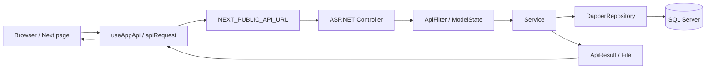

## 目錄

1. [文件定位與使用方式](#1-文件定位與使用方式)
2. [專案總覽](#2-專案總覽)
3. [快速定位表](#3-快速定位表)
4. [啟動、建置與環境](#4-啟動建置與環境)
5. [整體資料流與責任分界](#5-整體資料流與責任分界)
   - [5.3 列表請求、狀態與競態控制](#53-列表請求狀態與競態控制)
6. [前端規格](#6-前端規格)
   - [6.1.1 PCR 模板頁面實作規則](#611-pcr-模板頁面實作規則)
   - [6.1.3 DataMaintenance 原料維護](#613-datamaintenance-原料維護)
   - [6.5 多語言系統：執行期載入與資料流](#65-多語言系統執行期載入與資料流)
      - [6.5.1 資料模型與識別方式](#651-資料模型與識別方式)
      - [6.5.2 前端初始化與切換流程](#652-前端初始化與切換流程)
      - [6.5.3 動態選單與頁面標題](#653-動態選單與頁面標題)
      - [6.5.4 後台維護流程](#654-後台維護流程)
      - [6.5.5 多語言功能開發檢查清單](#655-多語言功能開發檢查清單)
      - [6.5.6 PCR 多語言資料規則](#656-pcr-多語言資料規則)
      - [6.5.7 使用者介面硬編碼中文盤點規則](#657-使用者介面硬編碼中文盤點規則)
7. [後端規格](#7-後端規格)
   - [7.2.1 Entity Model 設定責任](#721-entity-model-設定責任)
   - [7.6 Migration 與實際資料庫更新](#76-migration-與實際資料庫更新)
8. [前後端 API 契約](#8-前後端-api-契約)
   - [8.4 PCR 模板 API 契約](#84-pcr-模板-api-契約)
9. [資料模型與業務規則](#9-資料模型與業務規則)
   - [9.1 基底欄位與狀態](#91-基底欄位與狀態)
   - [9.2 主要資料表](#92-主要資料表)
   - [9.3 領域規則](#93-領域規則)
      - [9.3.1 PCR 模板父子資料與列表規則](#931-pcr-模板父子資料與列表規則)
   - [9.4 ManyToMany 關聯設計與使用方式](#94-manytomany-關聯設計與使用方式)
10. [常見修改路徑](#10-常見修改路徑)
    - [10.5 新增或修改多語言](#105-新增或修改多語言)
    - [10.6 修改 PCR 模板功能](#106-修改-pcr-模板功能)
11. [已確認的限制與注意事項](#11-已確認的限制與注意事項)
12. [維護規則](#12-維護規則)

# HOP-CFP 專案索引

> 本文件是給 AI 與開發者使用的快速入口。內容依 2026-08-05 工作區原始碼、設定、Migration、資料庫與瀏覽器驗證整理；若本文件與程式碼不一致，以實際執行程式碼與 API 結果為準，並應在修改後同步更新本文件。

## 1. 文件定位與使用方式

### 1.1 先讀哪裡

1. 先讀本文件，依「快速定位表」找到責任層與入口檔。
2. 依目前任務先讀必要的章節與入口檔即可，不需要通讀整份文件；只有在資料流或責任邊界仍不清楚時，才擴大閱讀範圍。
3. 前端問題先看 `apps/CFP/src/app` 的頁面，再追 `useAppApi`、`API_MAP` 與對應後端 Controller。
4. 後端問題先看 `Controllers`，再追對應 `Services`、`ViewModels` 與 `HOP-CFP-Backend.Library/Models`。
5. 若涉及資料表、欄位或 Migration，讀 `HOP-CFP-Backend.Library/Models/DBContext.cs`、對應 Model 及 `HOP-CFP-Backend/Migrations`。
6. 後端專案已有較細的索引：[HOP-CFP-Backend/BACKEND_PROJECT_INDEX.md](../HOP-CFP-Backend/HOP-CFP-Backend/BACKEND_PROJECT_INDEX.md)；本文件負責補足前後端整合視角。

帳號: Tim
密碼: !Qaz2wsx

### 1.2 文件不取代的內容

- 本文件不取代 TypeScript 型別、C# DataAnnotation、SQL 查詢與實際 API 回應。
- 未在程式碼中確認的部署、正式資料、外部郵件服務與資料庫內容，不在此推測。
- 機密連線字串與密碼不應寫入索引；環境檔目前含開發設定，使用時仍須遵守工作區安全規範。

## 2. 專案總覽

| 項目 | 實際規格 |
|---|---|
| 專案 | HOP-CFP / HDP-CFP |
| 前端 | `apps/CFP`，Next.js `^16.1.1`、React `19.2.0`、TypeScript 5 |
| 前端架構 | Next.js App Router、Route Groups、Client Components、正式環境靜態輸出 |
| 前端 UI | Bootstrap 5、Font Awesome、SCSS |
| Monorepo | Turborepo + npm workspaces；共用程式在 `packages/*` |
| 後端 | 相鄰 Repository `C:\Users\s7514\source\repos\HOP-CFP-Backend` |
| 後端主專案 | `HOP-CFP-Backend/HOP-CFP-Backend.csproj` |
| 後端共用 Library | `HOP-CFP-Backend/HOP-CFP-Backend.Library/HOP-CFP-Backend.Library.csproj` |
| 後端框架 | ASP.NET Core / .NET 10、C# nullable enable |
| 資料庫 | SQL Server |
| 存取方式 | Dapper / Dapper.Contrib 執行查詢與寫入；EF Core `DBContext` 與 Migration 維護 schema |
| 認證 | 登入後以 `Log_ManagerLogin.Id` 作為 Guid token，token 存於後端 `IMemoryCache` 20 分鐘 |
| 主要業務 | 管理員、角色/選單/功能、供應商、料號、料號群組、買賣方料號比對、更新通知與狀態報表 |

### 2.1 Repository 結構

```text
HOP-CFP/
├─ AGENTS.md                         AI 執行規則與啟動入口
├─ PROJECTINDEX.md                   本文件
├─ apps/CFP/                         Next.js 前端應用
│  ├─ src/app/                       頁面與 Route Groups
│  ├─ src/config/                    選單與 API 常數
│  ├─ src/contexts/                  User/Menu Context
│  ├─ src/hooks/                     前端 API 與權限 Hook
│  ├─ src/components/                CFP 專用元件
│  └─ public/                        Bootstrap、Font Awesome、圖片
├─ packages/                         共用 React 元件、Hook、Context、型別與工具
└─ package.json                      workspace 與 Turbo 指令

HOP-CFP-Backend/
├─ HOP-CFP-Backend.Library/          Models、DBContext、Dapper Repository、Attributes
│  └─ Models/
│     ├─ DBContext.cs                全域 EF 設定、非 IdModelBase Entity 設定與共用掃描
│     ├─ ModelBase.cs                IdModelBase 與 OnModelCreating 擴充入口
│     └─ Carbon/、Manager/、System/  各 Entity 的 OnModelCreating 與資料欄位定義
└─ HOP-CFP-Backend/                  Controllers、Services、ViewModels、Filters、Migrations
```

## 3. 快速定位表

| 要確認的問題 | 首要檔案 | 下一個責任點 |
|---|---|---|
| 頁面路由或畫面行為 | `apps/CFP/src/app/**/page.tsx` | 同資料夾 `Content.tsx`、`FormPageWrapper`、`CommonTable` |
| 登入、註冊、忘記/重設密碼 | `apps/CFP/src/app/(auth)/*/page.tsx` | `ManagerController.cs` → `ManagerService.cs` |
| API URL | `apps/CFP/src/lib/apiRoutes.ts`、`apps/CFP/.env*` | 後端 `Controllers/*Controller.cs` |
| Token / 401 / 登出 | `apps/CFP/src/hooks/useAppApi.tsx`、`packages/lib/api.ts` | `Filter/ApiFilter.cs`、`ManagerService.Login` |
| 動態選單與前端權限按鈕 | `apps/CFP/src/contexts/MenuContext.tsx`、`usePagePermissions.ts` | `ManagerService.Login` → `RoleService.GetRoleAdminMenus` |
| 列表查詢與分頁 | `apps/CFP/src/components/common/CommonTable.tsx` | `Controllers/Base/StandardController.cs` → `Services/Base/StandardService.cs` |
| 新增 / 編輯表單 | `apps/CFP/src/components/common/FormPageWrapper.tsx`、各功能 `Create/Edit/page.tsx` | `StandardController.Create/Edit` → `_ModelService.Insert/Update` |
| 管理員與角色權限 | `src/app/(main)/Manager`、`Role`、`AdminMenu`、`AdminFunction` | 對應 Service、`ManyToManyService`、`ManyToMany` |
| 多語言設定 | `apps/CFP/src/app/(main)/LanguageResource` | `LanguageController` / `LanguageResourceController` → `LanguageService` / `LanguageResourceService` |
| 料號匯入 | `src/app/(main)/Material/page.tsx` | `MaterialController.Import` → `MaterialService.ImportFromCsv` |
| 賣方比對匯入 | `src/app/(main)/SellerCompare/page.tsx` | `SellerCompareController.Import` → `SellerCompareService.ImportFromCsv` |
| 通知建立/狀態 | `MaterialNotify/page.tsx`、`StatusQuery/page.tsx`、`NotifyStatusReport/page.tsx` | 三個對應 Controller / Service |
| PCR 模板與父子項目 | `src/app/(main)/PcrTemplate/page.tsx`、`Content.tsx` | `PcrTemplateController` → `PcrTemplateService` → `PcrTemplate` / `LanguageResource` |
| 產品次類別維護與 PCR 模板 | `src/app/(main)/ProductSubcategory/page.tsx`、`PcrPattern/*` | `ProductSubcategoryController` → `ProductSubcategoryService` / `PcrPatternService`；PCR 模板依目前帳號與 `ProductSubcategoryId` 隔離 |
| DataMaintenance 原料維護 | `src/app/(main)/DataMaintenance/MaterialMaintenance/page.tsx`、`src/types/materialMaintenance.ts` | `MaterialMaintenanceController` → `MaterialMaintenanceService`；只顯示 PCR 原料頁籤（`PcrPattern.Category=Material`）的 4 個根項目、細項、年份與供應來源 |
| PCR 模板資料維護（Legacy） | `src/app/(main)/PcrPattern/page.tsx`、`Content.tsx` | `PcrPatternController` → `PcrPatternService` → `PcrPattern`；欄位與父子流程對齊 `PcrTemplate`，但仍停用選單與權限 |
| 資料表欄位與 Migration | `HOP-CFP-Backend.Library/Models/*`、`DBContext.cs` | `HOP-CFP-Backend/Migrations/*` |
| Entity 關聯、索引與 EF 設定 | 對應 Model 的 `OnModelCreating` | `DBContext.cs` 的全域規則與 `IdModelBase` 掃描 |

## 4. 啟動、建置與環境

### 4.1 前端

| 用途 | 指令 / URL |
|---|---|
| 安裝依賴 | `npm install`（Repository root） |
| 開發 | `npm run dev -w cfp` |
| 開發網址 | `http://localhost:3001` |
| 建置 | `npm run build` 或 `npm run build -w cfp` |
| 啟動建置結果 | `npm run start -w cfp` |
| Lint | `npm run lint` 或 `npm run lint -w cfp` |
| 正式輸出 | `NODE_ENV=production` 時 `output: export`，輸出到 root `out/cfp` |

目前 `apps/CFP/.env` 的開發 API URL 是 `https://localhost:7007`；`.env.production` 指向部署 API。`NEXT_PUBLIC_API_URL` 會直接組入 `API_MAP`，因此修改環境值時須同時確認後端實際 Route 前綴。

### 4.2 後端

| 用途 | 指令 / URL |
|---|---|
| 啟動 HTTPS | `dotnet run --project HOP-CFP-Backend.csproj --launch-profile https` |
| HTTPS | `https://localhost:7007` |
| HTTP 開發端口 | `http://localhost:5224` |
| 建置 | `dotnet build HOP-CFP-Backend.csproj --no-restore`（`HOP-CFP-Backend` 專案資料夾） |
| API 文件 | Development 環境啟用 OpenAPI、Swagger、Swagger UI |
| Session Cookie | `HOP_CFP_Backend`，HttpOnly、Secure、SameSite=Lax、20 分鐘 |

後端 `appsettings.json` 提供 SQL Server `DefaultConnection`、`UploadFilePath=./wwwroot`、`SiteSettings:FrontendUrl`；本索引不重複保存連線秘密。

### 4.3 驗證優先順序

1. 先執行與修改責任點直接相關的 lint / build。
2. API 修改要用 HTTPS profile 重啟後端，再用實際請求確認 HTTP status、`success`、`message`、`data`。
3. UI 修改在環境允許時啟動前後端、登入並操作受影響頁面。
4. 需要真實資料寫入或郵件發送時，先確認測試資料與授權範圍；不可把只完成 build 當成整合驗證。
5. 瀏覽器驗證要同時觀察頁面狀態、Network 請求、HTTP status、回應資料與是否重新導向登入；頁面最後顯示正確不代表中間沒有重複請求或競態。
6. 使用真實資料測試新增/編輯/刪除時，測試前記錄資料 Id，測試後確認子資料、翻譯資源與軟刪除狀態均已清理。

本次盤點在兩個 Repository 中未找到獨立測試專案或常見 `*.test.*` / `*.spec.*` 測試檔；目前驗證主力是 lint、build、API 請求與實際 UI 操作。

## 5. 整體資料流與責任分界



### 5.1 前端責任

- Page 負責路由、畫面狀態、搜尋條件與呼叫哪個 API。
- `Content.tsx` 負責複雜表單的欄位與子資料呈現。
- `CommonTable` 負責通用列表、分頁與查詢參數組裝。
- `FormPageWrapper` 負責取得 `?id=`、載入 Model、提交與成功導回。
- `useAppApi` 負責讀取 token、補 `Authorization`、收到 401 時清理 localStorage 並導向 `/login`。
- 前端不應把 SQL 或後端商業規則複製到頁面。

### 5.2 後端責任

- Controller 負責路由、Binding、ModelState、交易包裝與回傳格式。
- Service 負責查詢 SQL、商業規則、Many-to-Many、匯入與郵件觸發。
- Repository 負責 Dapper 連線、Transaction 與 CRUD 呼叫。
- Library Model / `DBContext` 定義資料表及欄位；Migration 記錄 schema 變更。
- `AuthorizedController` 實際套用 `ApiFilter`；`AuthorizeFilter` 是保留中的另一套權限判斷，不能假設它目前生效。

### 5.3 列表請求、狀態與競態控制

通用列表的實際執行鏈不是「按下查詢就直接呼叫一次 API」，而是由 `CommonTable` 的查詢狀態與 effect 統一觸發：

```text
Page search state
  └─ CommonTable.search(params)
       └─ setCurrentSearchParams(params)
            └─ useEffect
                 └─ fetchList(page, currentSearchParams)
                      └─ buildTableQuery(order/start/length/draw + search params)
                           └─ POST [Controller]/GetList
```

- `CommonTable` 使用 `apiUrl` 模式時，`search()` 只更新查詢 state，不應在頁面另外直接呼叫 `getData()` 或自行發送同一筆列表請求。
- `reload()` 會以目前頁碼與目前搜尋條件重新查詢；刪除成功、語言切換或需要重新整理列表時應優先使用此入口。
- `fetchList` 以 `requestIdRef` 保存請求序號。新請求開始後，舊請求即使較晚回來，也不可覆蓋新資料、總筆數或 loading 狀態。
- 新請求開始時會清除舊的 `data` 與 `totalRecords`；`isFetching` 時 `visibleData` 為空，避免畫面看起來已有資料但仍不能操作。
- `post` 以 ref 保存，避免 `useAppApi` 每次 render 產生新的 function reference，造成 effect 重複執行。
- `currentSearchParams`、`apiUrl`、`pageSize` 是查詢 effect 的核心依賴。若頁面把不穩定的物件或 function 直接放入依賴，會造成分類切換、搜尋或重整時重複 load。
- 列表通常回傳 `draw`、`recordsTotal`、`recordsFiltered`、`data`；必須等資料與總筆數都完成更新後才顯示可操作的分頁資訊。
- 發現列表「先有資料、不能操作、稍後才出現共 X 筆」時，先檢查 request 是否重複、舊請求是否覆蓋新請求、舊資料是否在 loading 期間被保留，而不是只修改 spinner 樣式。
- 另有一種不同的短暫現象：`LanguageProvider` 初始翻譯 map 為空，且與 `CommonTable` 的列表請求平行載入；若列表先回傳，`CommonTable` 的總數列因未提供翻譯 fallback 會先渲染成裸數字（例如 `4`），待 `LanguageResource/GetTranslations` 完成後才變成「共 4 筆資料」。這是文字翻譯載入競態，不是列表 API 重複或資料筆數變動；修正時應集中處理翻譯載入完成條件或總數列 fallback。

## 6. 前端規格

### 6.1 App Router 與頁面

Route Group `(auth)` 與 `(main)` 不會出現在 URL。根 Layout 以 `ApiProvider`、`ToastProvider`、`UserProvider`、`MenuProvider` 包住全部頁面；`(main)/layout.tsx` 再提供主導覽列、側欄與路徑權限檢查。

| URL | 檔案 | 功能 |
|---|---|---|
| `/` | `src/app/(main)/page.tsx` | 登入後主頁 |
| `/login/` | `src/app/(auth)/login/page.tsx` | 登入；保存 token、使用者名稱、動態選單 |
| `/register/` | `src/app/(auth)/register/page.tsx` | 管理員註冊 |
| `/forgot-password/` | `src/app/(auth)/forgot-password/page.tsx` | 寄送重設密碼郵件 |
| `/reset-password/` | `src/app/(auth)/reset-password/page.tsx` | 以 query `token` 重設密碼 |
| `/Manager`、`/Manager/Create`、`/Manager/Edit/?id={id}` | `src/app/(main)/Manager` | 管理員列表、新增、編輯、刪除 |
| `/Role`、`/Role/Create`、`/Role/Edit/?id={id}` | `src/app/(main)/Role` | 角色與選單/功能關聯 |
| `/AdminMenu`、`/AdminMenu/Create`、`/AdminMenu/Edit/?id={id}` | `src/app/(main)/AdminMenu` | 後台選單與子項目 |
| `/LanguageResource`、`/LanguageResource/Create`、`/LanguageResource/Edit/?id={id}` | `src/app/(main)/LanguageResource` | 語言、翻譯資源與流水號管理 |
| `/AdminFunction`、`/AdminFunction/Create`、`/AdminFunction/Edit/?id={id}` | `src/app/(main)/AdminFunction` | 功能與 Action、子功能 |
| `/Supplier`、`/Supplier/Create`、`/Supplier/Edit/?id={id}` | `src/app/(main)/Supplier` | 供應商資料 |
| `/Material`、`/Material/Create`、`/Material/Edit/?id={id}` | `src/app/(main)/Material` | 料號資料、範本下載、匯入 |
| `/MaterialGroup`、`/MaterialGroup/Create`、`/MaterialGroup/Edit/?id={id}` | `src/app/(main)/MaterialGroup` | 料號群組與料號多對多 |
| `/BuyerCompare`、`/BuyerCompare/Edit/?id={id}` | `src/app/(main)/BuyerCompare` | 買方料號比對 |
| `/SellerCompare`、`/SellerCompare/Edit/?id={id}` | `src/app/(main)/SellerCompare` | 賣方料號比對、範本下載、匯入 |
| `/MaterialNotify` | `src/app/(main)/MaterialNotify/page.tsx` | 料號更新通知選取與發送 |
| `/StatusQuery` | `src/app/(main)/StatusQuery/page.tsx` | 通知狀態明細查詢 |
| `/NotifyStatusReport` | `src/app/(main)/NotifyStatusReport/page.tsx` | 通知狀態彙總報表 |
| `/PcrTemplate`、`/PcrTemplate/Create`、`/PcrTemplate/Edit/?id={id}` | `src/app/(main)/PcrTemplate` | PCR 模板範本、分類頁籤與父子項目維護 |
| `/ProductSubcategory`、`/ProductSubcategory/Create`、`/ProductSubcategory/Edit/?id={id}` | `src/app/(main)/ProductSubcategory` | 產品次類別維護；提供產品次類別搜尋、新增、編輯、刪除與 PCR 模板查看入口 |
| `/ProductSubcategory/PcrPattern/?id={productSubcategoryId}`、`/Create`、`/Edit` | `src/app/(main)/ProductSubcategory/PcrPattern` | 產品次類別專屬 PCR 模板；首次查看依目前帳號複製 `PcrTemplate` 父子資料，並依 `X-Language-Code` 優先使用目前語系文字 |
| `/DataMaintenance`、`/DataMaintenance/MaterialMaintenance/?id={materialId}` | `src/app/(main)/DataMaintenance/page.tsx`、`src/app/(main)/DataMaintenance/MaterialMaintenance/page.tsx`、`src/components/common/PcrBindingModal.tsx` | 列表直接重用 `Material/GetList`；原料維護頁依 Material 綁定的 PCR 模板列出第一層、子項目、年份與供應來源，可新增/刪除年份及新增/刪除供應來源；資料保存於 `MaterialMaintenanceYear`、`MaterialMaintenanceSource`；固定文案使用 `DM0001`–`DM0015`、`RM0001`–`RM0032` 多語言資源 |
| `/PcrPattern`、`/PcrPattern/Create`、`/PcrPattern/Edit/?id={id}` | `src/app/(main)/PcrPattern` | Legacy PCR模板資料維護；使用 `ParentId`、`Category`、`Item` 與子項目，仍不掛載實際選單與權限 |

#### 6.1.1 PCR 模板頁面實作規則

- `/PcrTemplate/` 使用四個頁籤對應 `PcrTemplateCategory`：`Material=0` 原料、`Process=1` 製程、`Transport=2` 運輸、`Waste=3` 廢棄。
- 上次選取的分類保存於 `localStorage`，鍵名為 `pcrTemplate.lastCategory`；頁面初次 hydration 完成前不直接使用瀏覽器儲存值，避免 SSR/CSR 狀態不一致。
- 切換頁籤只更新儲存的分類，分類變更 effect 再呼叫 `CommonTable.search()`；不要在 click handler 與 effect 各查詢一次。
- 從某一分類按「新增」時，導向 `/PcrTemplate/Create?category={category}`，新增頁會以 query 的分類作為預設值。
- 清除搜尋會將分類重設為原料、清空項目搜尋文字，並只觸發一次列表查詢。
- 列表只顯示父項目；編輯與刪除按鈕依 `usePagePermissions()` 的 `Edit` / `Delete` 判斷，圖示分別使用編輯與垃圾桶圖示。
- PCR 新增、編輯採 Supplier 風格的獨立 `/Create`、`/Edit` 頁面，不在列表中開啟大型 modal。
- `Content.tsx` 同時呈現父項目與子項目輸入列；子項目可新增、修改、移除，父子資料一併提交。
- 列表項目搜尋只針對父項目的多語言文字；子項目名稱是列表顯示欄位，不會因為子項目 JOIN 而變成獨立列表列。

#### 6.1.2 產品次類別維護

- `/ProductSubcategory/` 是獨立於 `/PcrTemplate/` 的功能，掛在「碳排資料維護」下；列表欄位為產品次類別、制定者、適用範圍、CCC code，另提供「PCR模板／查看」按鈕。
- 產品次類別直接使用 `ProductSubcategory.Name` 儲存名稱，不建立多語言資料關聯；列表與搜尋直接查詢 `Name`。
- `AdminFunction` 的 `ProductSubcategory/Index` 根功能直接提供查詢，不另建立查詢子功能；新增、修改、刪除為子功能，Migration 將選單與功能授予系統管理員角色。
- `PcrPattern` 為獨立的 Legacy PCR 模板資料表，欄位與父子維護流程對齊 `PcrTemplate`；產品次類別入口先呼叫 `EnsurePcrPattern` 完成首次初始化，再由 `GetPcrPattern` 純查詢列表，並以帳號與 `ProductSubcategoryId` 隔離，原本的 PcrPattern 選單入口仍停用。
- `EnsurePcrPattern` 初始化時由 request 的 `X-Language-Code` 選取 `PcrTemplate` 翻譯；指定語系沒有有效文字時 fallback 到基礎語言。初始化只在該帳號與產品次類別尚無 `PcrPattern` 時執行，不會覆蓋既有資料。
- `/DataMaintenance` 列表仍直接查詢既有 `Material`；進入 `/DataMaintenance/MaterialMaintenance/?id={materialId}` 後，原料維護資料由 `MaterialMaintenanceYear`（Material + PcrPattern 子項目 + 年份）與 `MaterialMaintenanceSource`（年份 + Supplier + 產品名稱 + 佔比）保存。
- `/DataMaintenance` 的 PCR綁定呼叫 `POST /Material/BindPcr`，以 `Material.Id` 作為 Source、`ProductSubcategory.Id` 作為 Target，透過 `ManyToMany` 保存；業務規則為 Material 與 ProductSubcategory 有效關聯各自只能有一筆，新綁定會將來源或目標的既有有效關聯軟刪除。

#### 6.1.3 DataMaintenance 原料維護

- 頁面沿用既有 CFP Bootstrap/Card/ActionBar 視覺語言，以摘要卡、第一層分類區塊、子項目卡片與年份/供應來源巢狀表格呈現；不將 PM 示意圖硬塞成寬表格，避免小螢幕橫向溢出。
- 顯示流程固定為 PCR 原料頁籤的 `PcrPattern.Category=Material` root → child item → year → supplier source，包含原料頁籤下的 4 個根項目及其細項；子項目卡片使用滿版欄位。頁面第一次載入會呼叫後端 `EnsureInitializedAsync`，沿用既有 PcrTemplate 多語言 fallback 初始化 PcrPattern，之後再查詢資料。
- 前端原料維護頁以 `page.tsx` 作為組合層，API 路由與回應正規化集中在 `materialMaintenanceService.ts`，年份/來源規則集中在 `materialMaintenanceValidation.ts`，非同步狀態與操作流程由 `useMaterialMaintenance.ts` 管理，階層呈現與來源 Modal 分別由 `MaterialMaintenanceView.tsx`、`MaterialMaintenanceSourceModal.tsx` 負責；新增/刪除後採背景重新查詢，保留既有畫面避免整頁閃爍。
- 年份限制為 1900–2100，同一 Material、PcrPattern 子項目不可重複有效年份；供應來源需屬於目前 Manager 可見的 Supplier，同一年份下 Supplier + ProductName 不可重複，且有效佔比總和不可超過 100%。
- 目前先完成 PM 示意圖要求的年份與供應來源管理；碳排係數、審查結果、供應商審核/產品審核等後續欄位尚未加入，避免在資料模型尚未定義時預留不一致欄位。

### 6.2 前端狀態與權限

- `UserContext`：從 `localStorage.userInfo` 還原 `username`；登入後寫入，登出時移除。
- `MenuContext`：從 `localStorage.menus` 還原動態選單；登入回傳 `AdminMenus` 後轉成 `MenuItem` 儲存。
- `usePagePermissions`：找出目前路徑選單項目的 `permissions`，以 Action 字串判斷按鈕權限。
- `MainLayout`：選單載入後只允許選單中的 href；子路徑會向父路徑比對，無權限導回 `/`。
- `Aside`：有 `isNextJsApp` 時使用 `router.push`，否則使用一般 `<a>`，以兼容其他平台路徑。
- 登出目前是前端清除 `token` / `userInfo` 後導向 `/login`，未看到呼叫後端登出 API。

### 6.3 API 呼叫核心

| 檔案 | 行為 |
|---|---|
| `apps/CFP/src/lib/apiRoutes.ts` | 集中列出 Controller/Action URL；`API_MAP` 目前直接以 `API_URL` 組字串 |
| `apps/CFP/src/lib/apiProxy.ts` | 只有 `buildBackendUrl` 與 `/api` 常數；目前沒有對應 Next `route.ts` 代理檔 |
| `packages/lib/api.ts` | 統一 `fetch`、JSON/FormData、Blob、401 refresh hook、API event |
| `packages/hooks/useApi.tsx` | loading/error、成功/422/一般錯誤 callback |
| `apps/CFP/src/hooks/useAppApi.tsx` | 注入 `Authorization: {token}`；401 清除 token 並導向登入；提供遞迴 FormData 的 `formPost` |
| `packages/contexts/ApiContext.tsx` | 收集 request event，顯示全域 `ApiError` |

`apiRequest` 對非 FormData body 送 JSON，對 FormData 不手動設定 Content-Type；列表頁會用 query string 傳 `order/start/length/draw` 及搜尋條件。

### 6.4 共用 UI 與型別

- `packages/components/bootstrap5/*`：Bootstrap 5 的 `Btn`、`Form`、`Input`、`Select`、`Table`、`Pagination`、`Modal`、`Toast` 等包裝元件。
- `packages/components/layouts/*`：通用 `Wrap`、`WrapMain`、`WrapContent`、`SidebarLayout`。
- `packages/contexts/*`：API、Toast、Sidebar、Head Context。
- `packages/hooks/*`：`useApi`、`useClickOutside`、`useConfirm`。
- `packages/types/*` 與 `apps/CFP/src/types/*`：API response、表單搜尋、業務資料的 TypeScript 宣告；後端回傳欄位名稱多為 PascalCase，頁面實際取值須核對 API response 與型別。

### 6.5 多語言系統：執行期載入與資料流

本專案不是 `next-intl`、檔案式 `locales` 或 locale 路由；翻譯內容由後端資料庫管理，前端在執行期載入。語言切換只改變選取的 language code，不會改變 URL 路由。

#### 6.5.1 資料模型與識別方式

- `Language` 是語言設定，包含名稱、語言代碼、啟用狀態、排序與 `IsBaseLanguage`；目前預設語言代碼是 `zh-TW`，系統預期只能有一個啟用中的基礎語言。
- `LanguageResource` 是一筆可翻譯資源，包含唯一 `SerialNumber` 與可選的 `AdminMenuId`；資源本身不再保存重複的 `SourceText`。
- `LanguageResourceTranslation` 以 `LanguageResourceId + LanguageId` 識別每個語言的文字；`Language.IsBaseLanguage = 1` 的翻譯列就是唯一基礎內容。
- 任何需要多語言名稱的資料表，欄位名稱使用 `{Name}LRID`（例如 `PcrTemplate.ItemLRID`）儲存 `LanguageResource.Id`。
- `apps/CFP/src/config/languageKeys.ts` 只保存穩定資源代號，不是翻譯字典；畫面應以 `translate(key, fallbackText)` 取得文字並保留 fallback。

#### 6.5.2 前端初始化與切換流程

1. 根 Layout 以 `LanguageProvider` 包住登入頁與主畫面。
2. `LanguageContext` 從 `localStorage.languageCode` 讀取目前語言；沒有值時使用 `zh-TW`。
3. 登入後先從 `localStorage.languageTranslations:{languageCode}` 讀取完整翻譯字典；沒有有效快取時才呼叫 `LanguageResource/GetTranslations`，以 FormData 傳入 `languageCode`，建立 `serialNumber -> text` 與 `languageResourceId -> text` 查找表。
4. 語言選擇器先呼叫 `LanguageResource/GetActiveLanguages`；選取語言時優先使用該語言快取，沒有快取才重新載入翻譯，成功才更新 language code。
5. `useAppApi` 將目前語言放在每個請求的 `X-Language-Code` header；後端找不到翻譯時回退至基礎語言或內建 fallback。
6. 前端會把包含兩種查找表的版本化翻譯結果寫入 `localStorage.languageTranslations:{languageCode}`；快取只在瀏覽器端使用，翻譯資源維護後若需要立即反映新內容，應清除對應語言快取或執行一次重新載入。

`LanguageContext` 提供兩種查找方式：

- `translate(serialNumber, fallbackText)`：一般 UI、按鈕、標籤與錯誤訊息。
- `translateByLanguageResourceId(languageResourceId, fallbackText)`：後端動態選單帶回 `LanguageResourceId` 時優先使用。

#### 6.5.3 動態選單與頁面標題

- 登入回應的 `AdminMenus` 包含 `title`、`englishCode`、`languageResourceId` 與權限；登入後轉成 `MenuItem` 保存至 `localStorage.menus`。
- `Aside` 與 `ActionBar` 先使用 `languageResourceId` 翻譯；沒有 ID 時才以 `englishCode` 對照 `apps/CFP/src/config/menus.ts` 的固定流水號映射。
- `menus.ts` 的靜態 `menus` 目前是空陣列；新增功能時應在後端 AdminMenu 建立關聯 LanguageResource，不能只依賴中文 label。

#### 6.5.4 後台維護流程

- `/LanguageResource` 載入啟用中的語言與 AdminMenu，透過 `LanguageResource/GetList` 查詢資源。
- 新增/編輯翻譯資源送出 `adminMenuId`、`status` 與 `translationList`；基礎語言列直接在翻譯清單編輯，後端依 `IsBaseLanguage` 驗證必填。
- 沒有指定 AdminMenu 時，後端使用 `CM` 作為流水號前綴；有指定時使用 AdminMenu 的 `EnglishCode` 再產生四位數序號。流水號具唯一性。
- 後端錯誤與 ModelState 訊息也使用 `LanguageResource` 資源代號；新增 `BackendMessageKeys` 時必須同步建立資源與 fallback。
- `GetActiveLanguages`、`GetTranslations` 雖標記 `IgnoreAuthorize`，實際仍先經 `ApiFilter` 要求 token；不能只看 Attribute 判定為匿名 API。

#### 6.5.5 多語言功能開發檢查清單

1. 新增可見文字時，先在 `languageKeys.ts` 增加穩定代號，再在畫面使用 `translate`。
2. 新增頁面標題或選單時，確認 ActionBar title、AdminMenu LanguageResourceId/EnglishCode、權限路由與翻譯資源是同一條資料鏈。
3. 新增語言或資源時，確認基礎語言、所有啟用語言、資源狀態與缺翻譯時的回退文字。
4. 修改 API 錯誤、驗證或 ModelState 時，保留 `X-Language-Code` 傳遞，不要只在前端覆蓋後端訊息。
5. `formPost` 會把巢狀陣列展開成 `translationList[0][...]`，修改欄位前要核對 ASP.NET Model Binder。
6. 至少驗證登入前/後切換語言、動態側欄/頁面標題、基礎語言 fallback、422/一般錯誤與登出後重新登入。

#### 6.5.6 PCR 多語言資料規則

- PCR 名稱不再保存於 `PcrTemplate.Item` 資料庫欄位；資料表使用 `ItemLRID` 指向 `LanguageResource`。
- API / 表單上的 `Item` 仍代表使用者輸入或依目前語言解析後的顯示文字，不代表資料表欄位。
- 新增或更新 PCR 時，`PcrTemplateService.ModelSave` 會建立或取得資源，以 `Language.IsBaseLanguage = 1` 找出基礎語言，寫入基礎翻譯後將資源 Id 寫入 `ItemLRID`；不再以固定 PCR 選單 GUID 綁定或驗證 `AdminMenuId`。
- `LanguageResource.SourceText` 已移除；新的 PCR 或其他多語言欄位不可重新依賴 SourceText。
- 編輯既有 PCR 時，後端仍會驗證 `ItemLRID` 資源存在；既有資源的 `AdminMenuId` 保留，不再要求其必須屬於固定 PCR 選單。
- 列表與明細優先使用 `X-Language-Code` 指定語言，找不到有效文字時 fallback 到啟用中的基礎語言。
- 子項目各自擁有獨立的 `ItemLRID`；固定欄位標籤則以 `languageKeys.ts` 加代號並透過 Migration 建立，例如「細項」使用 `PC0014`。

#### 6.5.7 使用者介面硬編碼中文盤點規則

- 使用者可見的標題、欄位、按鈕、提示、Toast、錯誤訊息與 `aria-label` 不得直接寫中文；應先在 `apps/CFP/src/config/languageKeys.ts` 建立代號，再以 `useLanguage().translate` 取值。
- `/DataMaintenance` 與 `PcrBindingModal` 的固定文字使用 `DM0001`–`DM0015`；產品次分類 PCR 頁面的初始化/載入錯誤使用 `PP0015`–`PP0017`；產品次分類列表的「查看」使用 `CM0117`。
- `/DataMaintenance/MaterialMaintenance` 的標題、第一層/子項目/年份/供應來源、操作結果與驗證 fallback 使用 `RM0001`–`RM0032`；後端年份/供應來源驗證錯誤使用 `ER0052`–`ER0060`。
- 上述固定文案與共用 API 錯誤標籤（`CM0119`–`CM0133`）由 `HOP-CFP-Backend/Migrations/20260807140000_LocalizeDataMaintenanceUi.cs` 建立繁中與英文翻譯，並補足既有 `CM0116` 的英文翻譯；`20260807143000_NormalizePcrPatternTranslations.cs`、`20260807150000_ActivatePcrPatternTranslations.cs` 會修正既有停用/異常的 `PP0015`–`PP0017`。`ApiError` 必須在 `LanguageProvider` 內由 `translate` 注入標籤。Migration 套用且資料庫查詢確認後，才可宣稱中英文資源完整。
- 共用套件元件不得自行依賴繁中文字串；例如分頁與下拉輸入提供英文 fallback 或可覆寫的 label，實際畫面應由應用層傳入翻譯後文字。
- `HeadContext` 的預設頁面標題由 `apps/CFP/src/app/layout.tsx` 在 `LanguageProvider` 內使用 `CM0030` 解析，並同步設定 `document.documentElement.lang`；`DataGrid` 的空資料訊息使用可覆寫的 `noDataMessage`，不可重新加入固定中文。
- `translate` 的 fallback 文字可以保留作為載入失敗時的最後保底，但不得把 fallback 當成正常語言來源；新文案的 fallback 使用英文，避免新增中文字串重新散落在頁面程式碼。翻譯快取版本目前為 `2`，新增資源或修正 seed translation 時要同步升版，避免舊的 `localStorage.languageTranslations:*` 遮蔽新資源。
- 盤點時要區分註解、型別註解、資料庫欄位/領域資料與實際 UI 文案；前者不屬於使用者介面翻譯範圍。共用套件若需要顯示文字，應由呼叫端傳入已翻譯的 label，不能依賴中文預設值。

- 後端 `BackendMessageKeys.Fallbacks` 僅作資料庫翻譯無法取得時的最後保底，統一維持可讀英文；正常繁中/英文回應仍由 `LanguageResource` 的 `ER0001`–`ER0060` 資源依 `X-Language-Code` 解析。新增後端錯誤代號時，必須同步建立啟用中的繁中與英文翻譯並確認 fallback 不含亂碼或硬編碼中文。

## 7. 後端規格

### 7.1 啟動管線與 DI

`Program.cs` 的實際管線為：Controllers / OpenAPI → Static Files → 自訂 upload Static Files → HTTPS redirection → Routing → Session → CORS `DevPolicy` → Authorization → MapControllers。

- CORS 開發來源：`https://localhost:3000`、`http://localhost:3001`，允許任意 Header/Method/credentials。
- `Services` 與 `Argument` namespace 下的公開、非 abstract class 會被反射自動註冊為 Scoped。
- `IDapperRepository` 使用 SQL Server；`IDbConnectionFactory` 為 Singleton。
- `IMailSender`、`MailSenderConfig` 為 Singleton。
- `LazyServiceArgument` 與 `Lazy<T>` 用來延後服務取得並避免建構子依賴擴散。

### 7.2 Controller 繼承與標準 CRUD

```text
StandardController<DBModel, ViewModel, Search, List, ListData>
  └─ AuthorizedController  [ServiceFilter(ApiFilter)]
      └─ BaseController
```

所有繼承 `StandardController` 的 Controller 都有以下 `[controller]/[action]` POST API：

| Action | 主要用途 | 預設權限標記 |
|---|---|---|
| `GetList` | 查詢、分頁、回傳 `PagingViewModel` | `Index` |
| `GetTableColumns` | 回傳 DataTable 欄位描述 | `Index` |
| `GetDetailModel` | 取得明細 Model | `Detail` |
| `GetNewModel` | 取得新增預設 Model | `Create` |
| `GetCopyModel` | 取得複製 Model | `Copy` |
| `GetModel` | 取得編輯 Model | `Edit` |
| `Create` | 新增 | Controller 標準權限流程 |
| `Edit` | 更新 | Controller 標準權限流程 |
| `Copy` | 複製新增 | Controller 標準權限流程 |
| `Save` | 通用儲存 | `Edit` |
| `Delete` | 軟刪除 | Controller 標準權限流程 |

標準 URL 例：`POST https://localhost:7007/Supplier/GetList`。後端 Controller 本身沒有統一 `[Route("api/[controller]/[action]")]`，所以是否出現 `/api` 必須以部署反向代理與環境設定實際確認。

### 7.2.1 Entity Model 設定責任

- Entity 專屬的關聯、索引與 DeleteBehavior 必須放在該 Model 的 `OnModelCreating(ModelBuilder modelBuilder)`；例如 `PcrPattern` 負責 `ParentId` 與 `ProductSubcategoryId`，`PcrTemplate` 負責 `ItemLRID` 與 `ParentId`。
- `DBContext.OnModelCreating` 只保留全域模型規則、反射掃描共用設定，以及不符合 `IdModelBase` Model 掃描條件的設定，例如 `Log_ManagerLogin.HasNoKey()`。
- `DBContext` 會對 `IdModelBase` Entity 建立實例並呼叫其 `OnModelCreating`；新增 Entity 專屬 EF 設定前，先確認該 Model 是否繼承 `IdModelBase`。
- 移動設定時必須保持原本的 ForeignKey、關聯方向、`WithMany()` 與 `DeleteBehavior`，並執行 Backend build 及 `dotnet ef migrations has-pending-model-changes`，確認沒有非預期的 schema 差異。

### 7.3 Controller 與自訂 Action

| Controller | Service / Model | 自訂 Action |
|---|---|---|
| `ManagerController` | `ManagerService` / `Manager` | `GetManagerSession`、匿名 `Login`、`GetCaptcha`、匿名 `ForgotPassword`、匿名 `ResetPassword`、匿名 `Register` |
| `AdminMenuController` | `AdminMenuService` / `AdminMenu` | `GetAdminMenus`（IgnoreAuthorize） |
| `AdminFunctionController` | `AdminFunctionService` / `AdminFunction` | `GetSelectListItems`（IgnoreAuthorize） |
| `RoleController` | `RoleService` / `Role` | `GetRoleItems`、`GetSelectListItems`（IgnoreAuthorize） |
| `SupplierController` | `SupplierService` / `Supplier` | `GetSelectListItems`、`test` |
| `MaterialController` | `MaterialService` / `Material` | `GetSelectListItems`、`GetKeywordSelectListItems`、`BindPcr`、`DownloadImportTemplate`、`Import`（IgnoreAuthorize） |
| `MaterialGroupController` | `MaterialGroupService` / `MaterialGroup` | 無，自用標準 CRUD |
| `BuyerCompareController` | `BuyerCompareService` / `Material` | `GetBuyerMaterialList` |
| `SellerCompareController` | `SellerCompareService` / `Material` | `DownloadImportTemplate`、`Import`（IgnoreAuthorize） |
| `MaterialNotifyController` | `MaterialNotifyService` / `MaterialNotify` | `AddNotify`、`test` |
| `StatusQueryController` | `StatusQueryService` / `MaterialNotify` | 無，自用標準 CRUD |
| `NotifyStatusReportController` | `NotifyStatusReportService` / `MaterialNotify` | 無，自用標準 CRUD |
| `PcrTemplateController` | `PcrTemplateService` / `PcrTemplate` | 標準 CRUD；以 `Category` 篩選父項目，編輯時一併保存 `ChildList` |
| `ProductSubcategoryController` | `ProductSubcategoryService` / `PcrPatternService` | 產品次類別 CRUD；以 `Name` 篩選並提供 PCR 模板初始化、查詢與父子 CRUD |
| `MaterialMaintenanceController` | `MaterialMaintenanceService` / `MaterialMaintenanceYear` / `MaterialMaintenanceSource` | 原料維護階層查詢、年份與供應來源新增/軟刪除；沿用 Material 的 Index/Edit 權限並驗證目前 Manager 可見範圍 |
| `PcrPatternController` | `PcrPatternService` / `PcrPattern` | Legacy PCR模板父子 CRUD；欄位為 `ParentId`、`Category`、`Item`，已停用選單與權限 |

### 7.4 驗證、授權與錯誤

1. `[AllowAnonymous]` Action 不經登入檢查。
2. 其餘 `AuthorizedController` Action 由 `ApiFilter` 讀 `Authorization` Header，要求可解析為 Guid token。
3. token 必須存在 `IMemoryCache`；成功後設定 `ManagerService.CurrentManager`。
4. 無 token 或 cache miss 回 HTTP 401，JSON 內容為 `Status=401`、`Success=false`、`Message=身份驗證失敗`。
5. `IgnoreAuthorize` 是舊 `AuthorizeFilter` 的權限例外標記；目前實際掛載的 `ApiFilter` 不使用它來跳過登入，故不可把它解讀成匿名 API。
6. `GlobalExceptionsFilter` 類別存在，但目前 `Program.cs` 未見全域註冊；Controller 的 `TransactionFunc` 與 `LogActionError` 會處理交易失敗與記錄。修改錯誤契約時須追前端 `res.status/res.message` 分支。

### 7.5 Service 與資料存取

- `_StandardService.GetList` 以 `main.Status != -1`、目前管理員 `TaxID` 作為基礎篩選，再套用領域條件、排序與 SQL Server `OFFSET/FETCH`。
- `_ModelService` 統一取得 Model、SetModel、Insert、Update、Copy、Delete；`Delete` 預設是 `Status=-1` 軟刪除，並刪除 ManyToMany 關聯。
- `Insert` / `Update` 自動填入 `CreateDate`、`CreateUserId`、`UpdateDate`、`UpdateUserId`。
- `DapperRepository` 以目前 request scope 的 connection/transaction 執行 SQL；`BaseService.TransactionFunc` 是需要多步寫入時的交易入口。
- 多語言列表與 PCR 初始化 SQL 的「指定語言 + 基礎語言 fallback」JOIN 由 `_StandardService.GetLanguageTranslationJoinSql` 統一產生；PcrTemplate 與 PcrPattern 初始化應共用此方法，ProductSubcategory 本身不使用多語言 JOIN。
- 多對多資料統一透過 `ManyToManyService` 寫入 `ManyToMany`，不要在頁面自行推導關聯表 SQL。

### 7.6 Migration 與實際資料庫更新

- 後端 Migration 位於相鄰 Repository 的 `HOP-CFP-Backend/Migrations`，目前開發資料庫是 SQL Server `CFPDev`；EF Core 只維護 schema 與 Migration，不代表每次 build 都會自動套用資料庫變更。
- `dotnet-ef` 的 tool manifest 位於後端專案資料夾 `HOP-CFP-Backend/dotnet-tools.json`。執行 EF 指令前應先切到包含 manifest 的資料夾，再執行 `dotnet tool restore`。
- 常用更新流程：

  ```powershell
  Set-Location C:\Users\s7514\source\repos\HOP-CFP-Backend\HOP-CFP-Backend
  dotnet tool restore
  dotnet build HOP-CFP-Backend.csproj --no-restore
  dotnet ef database update --no-build
  dotnet ef migrations list --no-build
  ```

- 新 Migration 的識別名稱必須排序在資料庫目前已套用的最後一筆之後。若資料庫已存在較晚日期的 Migration，卻新增一筆較早時間的檔名，EF 可能將資料庫視為已在較新版本，導致新 Migration 不會被套用；本次實際已確認此風險。
- 手寫只含 `migrationBuilder.Sql(...)` 的 Migration，除了 `Up` / `Down`，仍要提供正確的 `[DbContext]`、`[Migration("migration-id")]` 與 `BuildTargetModel`，否則 `dotnet ef migrations list` 可能不會辨識該 Migration。
- Migration 的 raw SQL 必須同時考慮既有資料、唯一流水號、基礎語言不存在、語言不存在與 rollback；新增固定翻譯資源時應以 `IF NOT EXISTS` 避免重複插入。
- 後端正在執行時，`HOP-CFP-Backend.exe` 可能鎖住 build 輸出；建置失敗時先找出並停止明確的後端 PID，不能使用名稱式或廣泛終止程序。若只需編譯驗證，也可使用 `/p:UseAppHost=false`，但仍要注意執行中的 DLL 是否已載入新版本。
- Migration 套用完成後仍需重新啟動後端，並以 Swagger 或實際 API 請求確認新的 SQL、欄位與資料已可被應用程式使用。
- 原料維護 schema 由 `20260807124857_MaterialMaintenanceSchema` 建立；`20260807160000_LocalizeMaterialMaintenance` 建立 `RM0001`–`RM0032` 與 `ER0052`–`ER0060` 的 zh-TW/en-US 資源。兩個 Migration 套用後，必須重新啟動後端再驗證 `/MaterialMaintenance/*` API。

## 8. 前後端 API 契約

### 8.1 API_MAP 對應表

| 前端常數 | 實際 Action |
|---|---|
| `SUPPLIER_CREATE/EDIT/GET_MODEL/GET_LIST` | `Supplier/Create`, `Edit`, `GetModel`, `GetList` |
| `SUPPLIER_GET_SELECT_LIST` | `Supplier/GetSelectListItems` |
| `ADMIN_FUNCTION_CREATE/EDIT/GET_MODEL/GET_LIST` | `AdminFunction/Create`, `Edit`, `GetModel`, `GetList` |
| `ADMIN_FUNCTION` | `AdminFunction` 前綴，刪除使用 `/Delete` |
| `ADMIN_MENU_CREATE/EDIT/GET_MODEL/GET_LIST` | `AdminMenu/Create`, `Edit`, `GetModel`, `GetList` |
| `MANAGER_CREATE/EDIT/GET_MODEL/GET_LIST` | `Manager/Create`, `Edit`, `GetModel`, `GetList` |
| `MANAGER_LOGIN/REGISTER/FORGOT_PASSWORD/RESET_PASSWORD/GET_CAPTCHA` | `Manager/Login`, `Register`, `ForgotPassword`, `ResetPassword`, `GetCaptcha` |
| `MATERIAL_CREATE/EDIT/GET_MODEL/GET_LIST` | `Material/Create`, `Edit`, `GetModel`, `GetList` |
| `MATERIAL_IMPORT/IMPORT_TEMPLATE` | `Material/Import`, `Material/DownloadImportTemplate` |
| `MATERIAL_GROUP_CREATE/EDIT/GET_MODEL/GET_LIST` | `MaterialGroup/Create`, `Edit`, `GetModel`, `GetList` |
| `BUYER_GET_MODEL/EDIT` | `Material/GetBuyerCompareModel`, `Material/EditBuyerCompareModel`（須以後端實際 Controller 再核對；目前 `BuyerCompareController` 的標準 API 與 `GetBuyerMaterialList` 是另一組入口） |
| `BUYER_MATERIAL_LIST` | `Material/GetBuyerMaterialList`（API_MAP 與目前 Controller 不一致，修改前必須先確認） |
| `SELLER_GET_MODEL/EDIT` | `Material/GetSellerCompareModel`, `Material/EditSellerCompareModel`（須以後端實際 Controller 再核對） |
| `SELLER_IMPORT/IMPORT_TEMPLATE` | `SellerCompare/Import`, `SellerCompare/DownloadImportTemplate` |
| `MATERIAL_NOTIFY_GET_LIST/ADD` | `MaterialNotify/GetList`, `MaterialNotify/AddNotify` |
| `PCR_TEMPLATE_CREATE/EDIT/GET_MODEL/GET_LIST` | `PcrTemplate/Create`, `Edit`, `GetModel`, `GetList` |
| `PCR_TEMPLATE_MST` | `PcrTemplate` 前綴，刪除使用 `/Delete`；Create/Edit 會處理 `ChildList` |
| `PRODUCT_SUBCATEGORY_CREATE/EDIT/GET_MODEL/GET_LIST` | `ProductSubcategory/Create`, `Edit`, `GetModel`, `GetList` |
| `PRODUCT_SUBCATEGORY_MST` | `ProductSubcategory` 前綴，刪除使用 `/Delete` |
| `PRODUCT_SUBCATEGORY_*_PCR_PATTERN` | `ProductSubcategory/EnsurePcrPattern`、`GetPcrPattern*`、`CreatePcrPattern`、`EditPcrPattern`、`DeletePcrPattern` |
| `MATERIAL_MAINTENANCE_GET_MODEL` | `MaterialMaintenance/GetModel` |
| `MATERIAL_MAINTENANCE_ADD_YEAR` / `DELETE_YEAR` | `MaterialMaintenance/AddYear`、`DeleteYear` |
| `MATERIAL_MAINTENANCE_ADD_SOURCE` / `DELETE_SOURCE` | `MaterialMaintenance/AddSource`、`DeleteSource` |
| `PCR_PATTERN_CREATE/EDIT/GET_MODEL/GET_LIST` | Legacy `PcrPattern/Create`, `Edit`, `GetModel`, `GetList` |
| `PCR_PATTERN_MST` | Legacy `PcrPattern` 前綴，刪除使用 `/Delete` |

目前已確認前端 Buyer/Seller 編輯頁的部分呼叫使用 `Material/*Compare*` 字串，而後端現存比對 Controller 是 `BuyerCompareController` / `SellerCompareController`。這是整合時的高風險交界，不能只依 `API_MAP` 名稱假設 endpoint 一定存在。

### 8.2 通用回應格式

一般後端回應使用：

```json
{
  "status": 200,
  "success": true,
  "message": "",
  "data": {}
}
```

列表的 `data` 通常是：

```json
{
  "draw": 2,
  "recordsTotal": 10,
  "recordsFiltered": 10,
  "data": []
}
```

檔案下載以 Blob 回傳；匯入使用 `multipart/form-data`，欄位是 `file` 與 `ignoreErrors`。前端的 `formPost` 會把巢狀物件/陣列展開成 `field[0]`、`field[child]` 型式，新增欄位時要確認 ASP.NET Model Binder 能接收。

### 8.3 登入流程

```text
Login page
  └─ POST Manager/Login?Account=...&Password=...
      └─ ManagerService 驗證 Manager + SHA256(password + 固定鹽)
          └─ 建立 Log_ManagerLogin
          └─ cache[token] = ManagerSessionModel（20 分鐘）
          └─ 回傳 Token、Name、AdminMenus
              └─ 前端寫入 localStorage.token/userInfo/menus
                  └─ 後續 Authorization: {token}
```

忘記密碼流程：`ForgotPassword` 對不存在 Email 也回成功訊息以避免洩漏帳號；存在時在 cache 保存 30 分鐘 reset token 並由 `IMailSender` 寄出。`ResetPassword` 驗證 token 後更新 SHA256 密碼、更新 `LastPasswordChangeDate`、移除 reset token。

### 8.4 PCR 模板 API 契約

PCR 使用 Standard CRUD API，主要入口如下：

| 方法 | Action | 用途 |
|---|---|---|
| `POST` | `PcrTemplate/GetList` | 依 `Category`、`Item`、`X-Language-Code` 查詢父項目列表 |
| `POST` | `PcrTemplate/GetModel` | 取得父項目與 `ChildList` |
| `POST` | `PcrTemplate/GetNewModel` | 取得新增預設資料 |
| `POST` | `PcrTemplate/Create` | 新增父項目，並同步新增子項目 |
| `POST` | `PcrTemplate/Edit` | 更新父項目，並同步新增、更新、軟刪除子項目 |
| `POST` | `PcrTemplate/Delete` | 遞迴刪除父項目與子項目 |

- `GetList` 的 `Category` 是 enum 整數，`Item` 是父項目搜尋文字；查詢語言由 `X-Language-Code` header 傳遞。
- 列表 DTO 的 `Item` 與 `SubItems` 都是解析後的顯示文字，不是 `PcrTemplate` 的資料庫欄位；前端 response 會以 camelCase 使用 `item`、`subItems`。
- `SubItems` 由後端一次 SQL 聚合子項目名稱，依 `Sequence`、`Id` 排序並使用 `、` 分隔，避免前端對每一列再發送子項目查詢。
- `GetList` 由 `GetBaseWhere()` 強制加上 `main.Status != -1 AND main.ParentId IS NULL`，因此子項目不會單獨出現在父列表。
- Create/Edit 的 `ChildList` 是巢狀 Model；前端 `formPost` 展開欄位時必須與 ASP.NET Model Binder 的集合命名一致。
- 後端會重新把每個子項目的 `Category` 設成父項目分類，不信任前端送來的子項目分類。
- 父項目與子項目都會做空白與同分類重複檢查；名稱比較使用基礎語言翻譯內容。

## 9. 資料模型與業務規則

### 9.1 基底欄位與狀態

所有 `IdModelBase` 預設有 Guid `Id`、建立/更新時間與人員、`Status`、`Sequence`。`EStatus`：`Deleted=-1`、`Disable=0`、`Enable=1`。一般列表排除 `-1`；刪除通常是軟刪除。

### 9.2 主要資料表

| 領域 | Model / Table | 主要欄位與關係 |
|---|---|---|
| 管理員 | `Manager` | `Account`、`Email`、`Name`、`TaxID`、`PasswordHash`、`EmailConfirm`、`LastPasswordChangeDate` |
| 權限 | `Role` | `Name`、`RoleType`；透過 `ManyToMany` 關聯 AdminMenu / AdminFunction |
| 選單 | `AdminMenu` | `ParentId`、`Title`、`AdminFunctionId`、`IconClass`、`Url`；有子項目 |
| 功能 | `AdminFunction` | `ParentId`、`Title`、`Controller`、`Action`、`Parameter` |
| 關聯 | `ManyToMany` | `SourceTable/SourceId`、`TargetTable/TargetId`、`RelationType`、`Params`；Manager 與 Role 也透過此表關聯 |
| 供應商 | `Supplier` | `Name`、`TaxID`、聯絡人、電話、Email |
| 料號 | `Material` | `SupplierId`、`MaterialNumber`、`ProductModel`、`ProductName`、`CanSell` |
| 群組 | `MaterialGroup` | `Code`、`Name`；與 Material 透過 ManyToMany |
| 規格 | `MaterialSpec` | `MaterialCompareId`、`MaterialId`、`SpecNumber`、`Name` |
| 比對 | `MaterialCompare` | `MaterialId`（賣方）與 `BuyerMaterialId`（買方） |
| 通知 | `MaterialNotify` | `MaterialId`、`IsSend`、`IsUpdate` |
| PCR 模板 | `PcrTemplate` | `Category`、`ParentId`、`ItemLRID`；父子自我關聯，名稱由 LanguageResourceTranslation 保存 |
| 產品次類別 | `ProductSubcategory` | `Name`、`Developer`、`ApplicableScope`、`CccCode`；名稱直接保存於 `Name` |
| PCR模板資料（Legacy） | `PcrPattern` | `ParentId`、`Category`、`Item`；欄位與父子流程對齊 `PcrTemplate`，但名稱直接保存於 `Item` |
| 原料維護年份 | `MaterialMaintenanceYear` | `MaterialId`、`PcrPatternId`、`Year`；外鍵限制刪除，索引 Material + 子項目 + 年份 |
| 原料維護供應來源 | `MaterialMaintenanceSource` | `MaterialMaintenanceYearId`、`SupplierId`、`ProductName`、`AllocationPercentage`；佔比為 decimal(5,2) |
| 稽核 | `Log_ManagerLogin`、`Log_ManagerLoginFail`、`Log_ManagerWatch`、`Log_BackendPageRequest`、`DataChange` | 登入、失敗、瀏覽、請求與異動紀錄 |
| 設定 | `SysConfig`、`KeyValueSetting` | 系統設定與可依類型/群組查詢的 key-value |

### 9.3 領域規則

- 管理員註冊會檢查 Account、Email 唯一性；依同 TaxID 的註冊順序自動分配公司管理員或新註冊角色。
- 登入查詢 `Status != -1`；停用帳號另外拒絕；成功登入建立登入紀錄與 token cache。
- `Manager` 與 `Role` 沒有直接的 `Manager.RoleId` 實體欄位；Manager 編輯畫面的 `RoleId` 是 DTO/表單欄位，實際關聯保存於 `ManyToMany`：`SourceTable='Manager'`、`SourceId=Manager.Id`、`TargetTable='Role'`、`TargetId=Role.Id`，有效資料需加 `Status <> -1`。
- 查詢 Manager 所屬 Role 時，使用 `Manager.Id → ManyToMany.SourceId → ManyToMany.TargetId → Role.Id` 的路徑；不要直接假設 `ManagerByRole` 或 `Manager.RoleId` 是目前的持久化結構。常用 SQL：

  ```sql
  SELECT m.Account, m.Name AS ManagerName,
         r.Id AS RoleId, r.Name AS RoleName, r.Type AS RoleType
  FROM [Manager] m
  JOIN [ManyToMany] mm
    ON mm.SourceTable = N'Manager'
   AND mm.SourceId = m.Id
   AND mm.TargetTable = N'Role'
   AND mm.Status <> -1
  JOIN [Role] r
    ON r.Id = mm.TargetId
   AND r.Status <> -1
  WHERE m.Status <> -1;
  ```
- Role 的 `Type` 對應：`1=系統管理員`、`2=公司管理員`、`3=一般員工`、`4=新註冊`；目前 Role 列表服務另有 `Role.Type = 3` 的既有篩選，查詢或修改權限流程時要先確認該篩選是否適用。
- AdminMenu / AdminFunction 列表基底只列 `ParentId is null`；編輯時一併保存子項目。
- Material 列表可依料號、供應商名稱搜尋；更新 Material 後，該供應商同料號的未更新通知會設為 `IsUpdate=1`。
- MaterialGroup 編輯會保存其 Material ManyToMany。
- SellerCompare 只處理 `CanSell=1` 的賣方料號；匯入以「賣方料號 + 對照供應商統編 + 對照料號」檢查重複。
- Material 匯入範本欄位：`供應商統編`、`料號`、`產品型號`、`產品名稱`、`是否可銷售`；供應商必須是目前管理員建立的資料。
- SellerCompare 匯入範本欄位：`料號`、`對照供應商統編`、`對照料號`；`ignoreErrors=true` 時跳過錯誤繼續，結果回傳總數、成功數、失敗數、錯誤清單。
- `MaterialNotify.AddNotify` 對每個 Material 建立通知並嘗試寄信給 Supplier.Email；寄信與資料寫入是並行工作，修改時要注意交易與例外處理。
- StatusQuery 依 `IsSend`、`IsUpdate`、更新日期篩選；NotifyStatusReport 依建立日期與供應商彙總寄送/更新數量。

#### 9.3.1 PCR 模板父子資料與列表規則

- `EPcrTemplateCategory` 固定值為 `0=原料`、`1=製程`、`2=運輸`、`3=廢棄`；父項目與子項目必須屬於同一分類。
- `PcrTemplate.ParentId` 是自我關聯：`NULL` 代表父項目，有值代表子項目。`DBContext` 使用 Restrict delete，刪除流程由 `PcrTemplateService` 明確遞迴處理。
- PCR 列表基底條件為 `Status != -1 AND ParentId IS NULL`，因此子項目不會單獨顯示；父項目編輯頁才載入 `ChildList`。
- 建立或編輯父項目時，`ChildList` 支援新增、修改與移除。既有子項目依 Id 更新，新 Id 新增，未保留的子項目軟刪除。
- 移除子項目時，同步刪除其 `LanguageResource`；刪除父項目時先遞迴處理所有有效子項目，再刪除父項目資源。
- 後端會將子項目分類強制設為父項目分類；不可依賴前端送來的 child category。
- 父項目與子項目會先 trim，空白值由 Controller 驗證拒絕；同一分類不可重複相同名稱，名稱比對以基礎語言翻譯內容為準。
- 列表 `SubItems` 由後端一次聚合有效子項目名稱，依 `Sequence`、`Id` 排序，以 `、` 分隔；沒有子項目時回傳空值，前端顯示空白。
- `SubItems` 的文字解析沿用目前語言 → 基礎語言 fallback；不可在前端針對每一個父項目再查詢子項目，避免 N+1 請求與列表載入延遲。
- PCR 功能在目前 CFP 權限資料中只提供系統管理員使用；前端仍依頁面 `Create`、`Edit`、`Delete` 權限控制操作圖示，後端授權不可只靠隱藏按鈕。

### 9.4 ManyToMany 關聯設計與使用方式

`ManyToMany` 是本專案用來處理跨資料表多對多關係的通用關聯表。它不是只服務某一個功能，也不是 EF Core 自動產生的單一固定 Join Entity；程式以「來源資料表 + 來源 Id」和「目標資料表 + 目標 Id」描述一筆關聯，因此同一張表可以承載 Manager、Role、AdminMenu、AdminFunction、MaterialGroup、Material 等不同領域的關係。

#### 9.4.1 資料結構與方向

`ManyToMany` 繼承 `IdModelBase`，實際欄位如下：

| 欄位 | 意義 | 使用規則 |
|---|---|---|
| `Id` | 關聯資料本身的 Guid | 每一筆關聯有自己的 Id，不是兩端資料的複合主鍵 |
| `SourceTable` | 來源/父資料表名稱 | 例如 `Manager`、`Role`、`MaterialGroup` |
| `SourceId` | 來源資料的 `Id` | 例如某一個 Manager 或 Role 的 Guid |
| `TargetTable` | 目標資料表名稱 | 例如 `Role`、`AdminMenu`、`AdminFunction`、`Material` |
| `TargetId` | 目標資料的 `Id` | 例如某一個 Role 或 Material 的 Guid |
| `RelationType` | 同一對資料可再細分的關係類型 | 目前 API 支援以此欄位過濾，但各功能是否使用要回到實際 Service 確認 |
| `Params` | 關聯額外參數 | 目前是字串欄位；不要假設一定是 JSON 或一定有內容 |
| `Status` | 關聯的啟用/刪除狀態 | 一般有效查詢應排除 `Status = -1` |

本專案統一採用 `Source -> Target` 的方向。也就是說，誰擁有或選取關聯對象，誰就是 `Source`；被選取的對象就是 `Target`。例如：

```text
Manager.Id      ── SourceId ──┐
                               ├─ ManyToMany ── TargetId ── Role.Id
Role.Id         ── SourceId ──┤
                               ├─ ManyToMany ── TargetId ── AdminMenu.Id
                               └─ ManyToMany ── TargetId ── AdminFunction.Id
MaterialGroup.Id ─ SourceId ───┴─ ManyToMany ── TargetId ── Material.Id
```

目前已確認的主要關聯如下：

| Source | Target | 實際用途 |
|---|---|---|
| `Manager` | `Role` | Manager 的角色；目前 Manager 編輯畫面雖然只有一個 `RoleId`，實際仍保存到通用關聯表 |
| `Role` | `AdminMenu` | 角色可使用的後台選單 |
| `Role` | `AdminFunction` | 角色可使用的功能/Action |
| `MaterialGroup` | `Material` | 料號群組包含哪些料號 |

這種設計的重點是：資料表之間通常沒有傳統的實體 Foreign Key 導航屬性，資料庫也不會替 `SourceId` 或 `TargetId` 判斷它實際指向哪張表。`SourceTable` 與 `TargetTable` 是必要的型別資訊，因此手寫 SQL 時不可只依 Id 連接。

#### 9.4.2 後端讀取流程

一般 Service 不應在 Controller 或前端自行拼關聯資料，而應使用 `ManyToManyService`：

1. `GetIdsBySource(sourceId, targetTable, relationType)`：依來源 Id 找出所有目標 Id。
2. `GetTargetIds<TTarget>(sourceId, relationType)`：用 Model 的 Table Attribute 自動取得目標表名稱，再呼叫上一個方法。
3. `GetTargetId<TTarget>(sourceId, relationType)`：在多筆結果中取第一筆，適合業務上預期只有一個目標的情況，例如目前 Manager 的單一 Role。
4. `GetSourceIds(targetId, targetTable, relationType)`：反向找出哪些來源資料連到某一個目標。
5. `_ModelService.GetMTMData/List`：從目標 Service 的角度，使用 `ManyToMany.TargetId = main.Id` Join 出完整目標 Model。

目前的權限讀取鏈如下：

```text
ManagerService.GetModel(managerId)
  └─ ManyToManyService.GetTargetId<Role>(managerId)
       └─ Manager(SourceId) -> Role(TargetId)

RoleService.GetRoleAdminMenus(managerId)
  └─ RoleService.GetMTMData(managerId)
       └─ Manager(SourceId) -> Role(TargetId)
  └─ ManyToManyService.GetIdsBySource(roleId, "AdminMenu")
       └─ Role(SourceId) -> AdminMenu(TargetId)
  └─ ManyToManyService.GetIdsBySource(roleId, "AdminFunction")
       └─ Role(SourceId) -> AdminFunction(TargetId)
```

因此，查詢某 Manager 的 Role，應沿著 `Manager.Id -> ManyToMany.SourceId -> ManyToMany.TargetId -> Role.Id`；查詢角色的選單或功能，則要先得到 `Role.Id`，再沿著 Role 作為 `SourceId` 查第二層關聯。

手寫 SQL 建議同時限制來源表、目標表與有效狀態：

```sql
SELECT m.Account,
       m.Name AS ManagerName,
       r.Id AS RoleId,
       r.Name AS RoleName,
       r.Type AS RoleType
FROM [Manager] AS m
JOIN [ManyToMany] AS mm
  ON mm.SourceTable = N'Manager'
 AND mm.SourceId = m.Id
 AND mm.TargetTable = N'Role'
 AND mm.Status <> -1
JOIN [Role] AS r
  ON r.Id = mm.TargetId
 AND r.Status <> -1
WHERE m.Account = @Account
  AND m.Status <> -1;
```

雖然目前 `ManyToManyService.GetIdsBySource` 的共用查詢主要以 `SourceId + TargetTable` 過濾，並會由基礎 `Sql` 套用關聯表的有效狀態條件，但文件、診斷 SQL 與新功能查詢仍應補上 `SourceTable`。這能避免不同資料表恰好使用相同 Guid 時，讀到不屬於該來源類型的關聯。

#### 9.4.3 後端寫入與同步流程

關聯寫入主要使用 `ManyToManyService.SaveById`，其概念是「以表單送回的目標 Id 集合，和資料庫現有集合做差異同步」：

1. 先以 `SourceId + TargetTable` 讀取現有 TargetId。
2. 對表單有、資料庫沒有的 Id 建立新列，並填入 `SourceTable`、`SourceId`、`TargetTable`、`TargetId`。
3. 對資料庫有、表單沒有的 Id 執行移除邏輯。
4. 保留兩邊都存在的關聯。

實際使用方式：

```csharp
// Manager：畫面只有一個 RoleId，但仍透過通用服務保存
await _lazy.ManyToManyService.Value.SaveById(
    managerModel,
    new[] { managerModel.RoleId.Value },
    nameof(Role));

// Role：一次保存所勾選的多個選單與功能
await _lazy.ManyToManyService.Value.SaveById(
    roleModel,
    roleModel.SelectedAdminMenuIds,
    nameof(AdminMenu));

await _lazy.ManyToManyService.Value.SaveById(
    roleModel,
    roleModel.SelectedAdminFunctionIds,
    nameof(AdminFunction));
```

前端送出的 `RoleId`、`SelectedAdminMenuIds` 或 `MaterialList` 只是表單/DTO 資料；真正的責任點在各領域 Service 的 `ModelSave`，由 Service 呼叫 `ManyToManyService.SaveById`。因此修改 UI 欄位名稱或 API Model 時，必須同步確認 Service 是否仍把 Id 集合保存到正確的 `TargetTable`。

#### 9.4.4 刪除、狀態與實作風險

- 一般資料刪除走 `_ModelService.Delete` 時，Service 會呼叫 `ManyToManyService.Delete(id)`；目前做法是把 `SourceId = id` 或 `TargetId = id` 的關聯更新為 `Status = -1`，屬於軟刪除方向。
- `ManyToMany` 初始 Migration 建立的是 `Id` 主鍵與 `SourceId/TargetTable/RelationType`、`TargetId` 索引，沒有看到以 Source/Target 組合建立的唯一約束；新增關聯前不能假設資料庫會自動阻止重複列。
- 目前 `SaveById` 的移除分支實作為依 `TargetId` 直接刪除 `ManyToMany` 列，沒有同時限制 `SourceId`、`SourceTable`、`TargetTable`。若同一個 Target 被多個 Source 共用，這可能連其他 Source 的關聯也一起移除；修改此邏輯前要先確認既有資料與預期共享行為。
- `ManyToManyService.GetTargetId<TTarget>` 只取第一筆；當資料模型允許多筆但呼叫端使用單值欄位時，結果不代表唯一正確關聯。Manager/Role 目前是「業務上預期單一 Role」，若未來要支援多角色，必須改 DTO、前端表單與讀寫流程，不能只把 SQL 改成回傳多列。
- 共用表沒有強型別 Foreign Key；查不到目標資料、目標資料被軟刪除、`TargetTable` 拼寫大小寫或名稱不一致，都可能造成關聯存在但畫面讀不到。新增關聯時優先使用 `nameof(TargetModel)` 或 `CommonUtility.GetTableAttribute<TModel>()`，不要手寫易錯字串。

#### 9.4.5 單一關聯替換

`ManyToManyService.SaveOneToOneAsync` 用於業務上要求雙方各只能有一筆有效關聯的情境，例如 `/DataMaintenance` 的 Material 與 ProductSubcategory PCR 綁定：

1. 以固定的 `SourceTable`、`TargetTable`、`SourceId`、`TargetId` 找出來源或目標相同的有效關聯。
2. 將既有關聯設為 `Status = -1`，保留歷史資料。
3. 新增目前選取的關聯。

Material 的 `/Material/BindPcr` 在交易內先驗證目前帳號可使用的 Material 與有效 ProductSubcategory，再呼叫此方法；前端選取時必須送出 ProductSubcategory GUID，不可使用非唯一的顯示文字代替。

#### 9.4.6 新增或除錯 ManyToMany 功能的檢查順序

1. 先確認 Source Model、Target Model、兩端主鍵欄位與實際 Table Attribute。
2. 確認關聯方向：誰是擁有者就放 `Source`，被選取資料放 `Target`；不要因為 UI 欄位名稱而顛倒方向。
3. 搜尋該功能的 `SetModel`、`ModelSave`、`GetIdsBySource`、`GetMTMData` 與原生 SQL，確認讀寫是否使用同一組 `SourceTable/TargetTable`。
4. 確認表單是單一 Id 還是 Id 集合；單一欄位通常會呼叫 `GetTargetId`，集合則應呼叫 `GetTargetIds` 或 `GetIdsBySource`。
5. 查資料庫時先用下列診斷 SQL 看原始關聯，再 Join 目標表：

   ```sql
   SELECT Id, SourceTable, SourceId, TargetTable, TargetId,
          RelationType, Params, Status, CreateDate, UpdateDate
   FROM [ManyToMany]
   WHERE (SourceId = @SourceId OR TargetId = @TargetId)
     AND Status <> -1
   ORDER BY CreateDate;
   ```

6. 驗證新增、替換、清空、刪除與軟刪除後的結果；特別檢查同一 Target 是否被其他 Source 共用，以及清空表單是否真的移除正確範圍的關聯。

總結：在本專案中，`ManyToMany` 不只是「兩張表中間多一張表」，而是以 Table 名稱和 Guid 動態描述關係的通用資料層。分析任何權限、群組或選取清單問題時，第一個問題應是「這筆資料是 Source 還是 Target、TargetTable 實際填什麼、關聯 Status 是否有效」，再追對應 Service 的讀寫方法。

## 10. 常見修改路徑

### 10.1 新增一個管理後台 CRUD

1. Library 建立 Model，繼承 `IdModelBase`，必要時在 `OnModelCreating` 加 schema 設定。
2. Backend `ViewModels` 建立主 Model、Search、List、ListData。
3. Backend 建立 Service，繼承 `_StandardService`；需要依賴時加入 `LazyServiceArgument`。
4. Backend 建立 Controller，繼承 `StandardController` 並確認 `ApiFilter`、`AuthorizeAs` 及 `AllowAnonymous`。
5. 建立 Migration，更新 `DBContext` / schema。
6. Frontend 建立列表、`Create`、`Edit` page；列表優先重用 `CommonTable`，表單優先重用 `FormPageWrapper`。
7. 在 `apiRoutes.ts` 增加常數，並同步更新本文件的 Controller、ViewModel、API 表。

### 10.2 修改列表搜尋

追蹤順序：頁面 search state → `CommonTable.search()` → query string → `BaseSearchViewModel` → 目標 Service 的 `GetListQueryString()`。日期上限需確認 Service 是否使用 exclusive upper bound；排序需確認 `GetOrderSql` 是否有覆寫。

### 10.3 修改登入或權限

同時檢查：`login/page.tsx` 的 URL/回應欄位、`UserContext`、`MenuContext`、`useAppApi`、`ApiFilter`、`ManagerService.Login`、`RoleService.GetRoleAdminMenus`、`ManyToMany`。只修改前端按鈕隱藏不等於後端授權安全。

### 10.4 修改匯入

同時確認範本檔欄位、Controller 的 `IFormFile` Binding、`ImportFileUtility` 解析、`ignoreErrors` 行為、資料權限篩選與回傳錯誤格式；至少要測試空檔、缺欄、必填缺漏、找不到關聯資料、重複資料與部分成功。

### 10.5 新增或修改多語言

1. 先判斷文字屬於前端固定 UI、動態 AdminMenu、LanguageResource 資源，還是後端 `BackendMessageKeys` 訊息，選擇正確的資源入口。
2. 前端固定 UI：更新 `apps/CFP/src/config/languageKeys.ts`，在畫面使用 `translate`，並建立對應的 `LanguageResource` 與各語言翻譯。
3. 動態選單：確認 AdminMenu 的 `LanguageResourceId` 或 `EnglishCode` 與 `menus.ts` 映射；同時驗證登入回應、`MenuContext`、`Aside`、`ActionBar`。
4. 後端訊息：確認 `BackendMessageKeys`、`MessageLocalizationService`、`X-Language-Code` header 與資料庫資源/fallback。
5. 多語言名稱欄位使用 `{Name}LRID`；新增資料時先建立基礎語言翻譯，不再把相同文字同時寫入 `SourceText`。
6. 依 6.5.5 的清單測試切換、回退、錯誤訊息與重新登入；完成後同步更新本文件的 API、資料流或限制說明。

### 10.6 修改 PCR 模板功能

1. 先確認修改的是父項目、子項目、列表顯示、分類頁籤、翻譯資源或權限，不要直接修改共用套件或資料表外欄位。
2. 前端先追 `PcrTemplate/page.tsx`、`Create/page.tsx`、`Edit/page.tsx`、`Content.tsx` 與 `src/types/pcrTemplate.ts`。
3. 後端依序確認 `PcrTemplateController`、`PcrTemplateService`、`PcrTemplateModel`、`PcrTemplate`、`DBContext`；列表查詢要同時檢查 `GetBaseWhere()`、`GetListQueryString()` 與 `GetListQueryString_MainSQL()`。
4. 修改父子資料時保留 `ParentId IS NULL` 的父列表規則、子項目分類繼承、差異同步、軟刪除與多語言資源清理。
5. 修改列表欄位時，先確認 DTO 欄位名稱，再確認 SQL alias、後端 JSON 命名策略、前端 TypeScript 型別與 `CommonTable` column key 四者一致。
6. 修改列表查詢時不得因子項目 JOIN 產生父項目重複列；需要顯示子項目時應使用一次聚合或明確的後端查詢。
7. 修改完成後至少驗證四個分類、分類記憶、新增預設分類、搜尋、空白/重複驗證、父子新增/編輯/刪除、語言 fallback、權限與列表 loading 時序。
8. 若新增固定 UI 文字，建立對應 LanguageResource Migration；Migration 套用後重啟後端，使用登入帳號在瀏覽器確認畫面與實際 API 回應。

## 11. 已確認的限制與注意事項

- `apps/CFP/src/config/menus.ts` 的靜態 `menus` 目前是空陣列；實際側欄依登入回傳的 `AdminMenus` 動態建立，因此未登入或 localStorage 遺失時主頁可能沒有可用選單。
- `API_MAP` 的 Buyer/Seller compare 部分與目前後端 Controller 命名存在不一致；任何比對功能修改前應先以瀏覽器 Network 或 curl 確認實際 endpoint，不要只看常數名稱。
- `apiRoutes.ts` 註解描述 `/api/{controller}/{action}`，但目前後端 Controller 的 Route 屬性是 `[controller]/[action]`；`/api` 是否由部署層補上尚未由本 Repository 原始碼證實。
- `apps/CFP/src/lib/apiProxy.ts` 沒有被證實是可運作的 Next API proxy；目前找不到 `route.ts` 實作，前端開發設定是直接呼叫 `https://localhost:7007`。
- 後端 `ApiFilter` 在 `DEBUG` 編譯條件下，缺少 token 時會嘗試使用資料庫最新登入紀錄或以固定測試帳密登入；這是開發行為，不可當成正式安全契約。
- `GetManagerSession`、Supplier/MaterialNotify 的 `test` 等端點存在但不一定被前端使用；`test` 端點涉及測試郵件或測試回應，修改/部署前要重新確認是否應保留。
- 前端目前以 localStorage 保存 token；這是既有架構，修改認證時需評估 XSS、跨來源、CORS、Secure cookie 與登出失效策略的整體影響。
- 後端連線字串使用外部 SQL Server；未啟動或無法連線資料庫時，前端 build 成功不代表登入、列表、匯入可用。
- 後端 token 存在 `IMemoryCache`；後端程序重啟後原 token 可能失效，瀏覽器會收到 401 並回到登入頁，整合測試不能假設重啟前的登入狀態仍有效。
- 本次工作區未找到獨立自動化測試專案或常見 `*.test.*` / `*.spec.*` 測試檔；目前主要驗證方式是 Problems、lint、build、Migration、Swagger/API 請求與瀏覽器操作。
- 前端 lint 目前有既有 warnings；驗證時應區分「本次新增 error」與「既有 warning」，不能為了清除警告而擴大修改範圍。
- 後端正在執行時可能鎖住 `HOP-CFP-Backend.exe`，導致一般 build 失敗或出現檔案鎖定 warning；應只處理明確的後端程序，不可使用廣泛程序終止指令。
- `CommonTable` 的列表是否真的只請求一次、資料與總筆數是否同步完成，必須用瀏覽器 Network/console 或 API 請求觀察，不能只看畫面最後結果。
- 多語言切換時要同時確認前端標籤、動態選單、API `X-Language-Code`、資料庫翻譯與基礎語言 fallback；只看到某一個畫面變更，不代表所有層都已切換。
- PCR 的列表「細項」驗證曾以瀏覽器暫時新增第二個子項目確認 `CPU、GPU` 聚合，再清除測試資料；測試資料寫入外部 `CFPDev` 前必須記錄並清理。

## 12. 維護規則

每次新增、修改或刪除以下項目時，應同步更新本文件相關章節：

- 前端 route、Page、Context、Hook、API 常數、環境變數與主要共用元件。
- 後端 Controller / Action、Service、ViewModel、Library Model、Filter、Utility、Migration。
- 認證 token、權限/選單結構、列表分頁契約、匯入欄位或資料篩選規則。
- PCR 的 `EPcrTemplateCategory`、`ParentId`、`ItemLRID`、`ChildList`、列表 `SubItems`、分類記憶鍵與 `PC0014` 翻譯資源。
- `CommonTable` 的查詢 effect、request sequence、loading 清除舊資料與 `search/reload` 行為；這些屬於共用元件的執行契約，變更時要重新驗證所有列表頁。
- 每次 Migration 套用後的實際資料庫版本、Migration 排序與 rollback 行為；不能只更新檔案而不確認 `dotnet ef migrations list` 與資料庫狀態。
- 每次功能完成後保留「程式檢查」「API 驗證」「瀏覽器驗證」「資料清理」的紀錄，並區分已確認結果與尚待驗證項目。

更新索引時保留「實際已確認」與「尚待驗證」的區分；若發現 API_MAP、Route、型別或既有索引矛盾，先以可執行程式碼與實際 Network/API 結果為準，再修正文件與必要程式碼。
