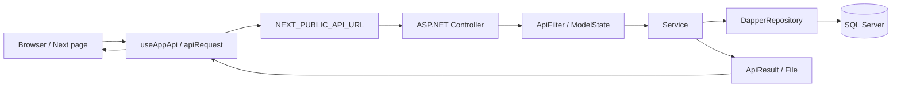

## 目錄

1. [文件定位與使用方式](#1-文件定位與使用方式)
2. [專案總覽](#2-專案總覽)
3. [快速定位表](#3-快速定位表)
4. [啟動、建置與環境](#4-啟動建置與環境)
5. [整體資料流與責任分界](#5-整體資料流與責任分界)
6. [前端規格](#6-前端規格)
7. [後端規格](#7-後端規格)
8. [前後端 API 契約](#8-前後端-api-契約)
9. [資料模型與業務規則](#9-資料模型與業務規則)
   - [9.1 基底欄位與狀態](#91-基底欄位與狀態)
   - [9.2 主要資料表](#92-主要資料表)
   - [9.3 領域規則](#93-領域規則)
   - [9.4 ManyToMany 關聯設計與使用方式](#94-manytomany-關聯設計與使用方式)
10. [常見修改路徑](#10-常見修改路徑)
11. [已確認的限制與注意事項](#11-已確認的限制與注意事項)
12. [維護規則](#12-維護規則)

# HOP-CFP 專案索引

> 本文件是給 AI 與開發者使用的快速入口。內容依 2026-07-27 工作區原始碼、設定與後端相鄰 Repository 盤點整理；若本文件與程式碼不一致，以實際執行程式碼為準，並應在修改後同步更新本文件。

## 1. 文件定位與使用方式

### 1.1 先讀哪裡

1. 先讀本文件，依「快速定位表」找到責任層與入口檔。
2. 前端問題先看 `apps/CFP/src/app` 的頁面，再追 `useAppApi`、`API_MAP` 與對應後端 Controller。
3. 後端問題先看 `Controllers`，再追對應 `Services`、`ViewModels` 與 `HOP-CFP-Backend.Library/Models`。
4. 若涉及資料表、欄位或 Migration，讀 `HOP-CFP-Backend.Library/Models/DBContext.cs`、對應 Model 及 `HOP-CFP-Backend/Migrations`。
5. 後端專案已有較細的索引：[HOP-CFP-Backend/BACKEND_PROJECT_INDEX.md](../HOP-CFP-Backend/HOP-CFP-Backend/BACKEND_PROJECT_INDEX.md)；本文件負責補足前後端整合視角。

### 1.2 文件不取代的內容

- 本文件不取代 TypeScript 型別、C# DataAnnotation、SQL 查詢與實際 API 回應。
- 未在程式碼中確認的部署、正式資料、外部郵件服務與資料庫內容，不在此推測。
- 機密連線字串與密碼不應寫入索引；環境檔目前含開發設定，使用時仍須遵守工作區安全規範。

## 2. 專案總覽

| 項目 | 實際規格 |
|---|---|
| 專案 | HOP-CFP / HDP-CFP |
| 前端 | `apps/CFP`，Next.js `^16.1.1`、React `19.2.0`、TypeScript 5 |
| 前端架構 | Next.js App Router、Route Groups、Client Components、正式環境靜態輸出 |
| 前端 UI | Bootstrap 5、Font Awesome、SCSS |
| Monorepo | Turborepo + npm workspaces；共用程式在 `packages/*` |
| 後端 | 相鄰 Repository `C:\Users\s7514\source\repos\HOP-CFP-Backend` |
| 後端主專案 | `HOP-CFP-Backend/HOP-CFP-Backend.csproj` |
| 後端共用 Library | `HOP-CFP-Backend/HOP-CFP-Backend.Library/HOP-CFP-Backend.Library.csproj` |
| 後端框架 | ASP.NET Core / .NET 10、C# nullable enable |
| 資料庫 | SQL Server |
| 存取方式 | Dapper / Dapper.Contrib 執行查詢與寫入；EF Core `DBContext` 與 Migration 維護 schema |
| 認證 | 登入後以 `Log_ManagerLogin.Id` 作為 Guid token，token 存於後端 `IMemoryCache` 20 分鐘 |
| 主要業務 | 管理員、角色/選單/功能、供應商、料號、料號群組、買賣方料號比對、更新通知與狀態報表 |

### 2.1 Repository 結構

```text
HOP-CFP/
├─ AGENTS.md                         AI 執行規則與啟動入口
├─ PROJECTINDEX.md                   本文件
├─ apps/CFP/                         Next.js 前端應用
│  ├─ src/app/                       頁面與 Route Groups
│  ├─ src/config/                    選單與 API 常數
│  ├─ src/contexts/                  User/Menu Context
│  ├─ src/hooks/                     前端 API 與權限 Hook
│  ├─ src/components/                CFP 專用元件
│  └─ public/                        Bootstrap、Font Awesome、圖片
├─ packages/                         共用 React 元件、Hook、Context、型別與工具
└─ package.json                      workspace 與 Turbo 指令

HOP-CFP-Backend/
├─ HOP-CFP-Backend.Library/          Models、DBContext、Dapper Repository、Attributes
└─ HOP-CFP-Backend/                  Controllers、Services、ViewModels、Filters、Migrations
```

## 3. 快速定位表

| 要確認的問題 | 首要檔案 | 下一個責任點 |
|---|---|---|
| 頁面路由或畫面行為 | `apps/CFP/src/app/**/page.tsx` | 同資料夾 `Content.tsx`、`FormPageWrapper`、`CommonTable` |
| 登入、註冊、忘記/重設密碼 | `apps/CFP/src/app/(auth)/*/page.tsx` | `ManagerController.cs` → `ManagerService.cs` |
| API URL | `apps/CFP/src/lib/apiRoutes.ts`、`apps/CFP/.env*` | 後端 `Controllers/*Controller.cs` |
| Token / 401 / 登出 | `apps/CFP/src/hooks/useAppApi.tsx`、`packages/lib/api.ts` | `Filter/ApiFilter.cs`、`ManagerService.Login` |
| 動態選單與前端權限按鈕 | `apps/CFP/src/contexts/MenuContext.tsx`、`usePagePermissions.ts` | `ManagerService.Login` → `RoleService.GetRoleAdminMenus` |
| 列表查詢與分頁 | `apps/CFP/src/components/common/CommonTable.tsx` | `Controllers/Base/StandardController.cs` → `Services/Base/StandardService.cs` |
| 新增 / 編輯表單 | `apps/CFP/src/components/common/FormPageWrapper.tsx`、各功能 `Create/Edit/page.tsx` | `StandardController.Create/Edit` → `_ModelService.Insert/Update` |
| 管理員與角色權限 | `src/app/(main)/Manager`、`Role`、`AdminMenu`、`AdminFunction` | 對應 Service、`ManyToManyService`、`ManyToMany` |
| 多語言設定 | `apps/CFP/src/app/(main)/LanguageResource` | `LanguageController` / `LanguageResourceController` → `LanguageService` / `LanguageResourceService` |
| 料號匯入 | `src/app/(main)/Material/page.tsx` | `MaterialController.Import` → `MaterialService.ImportFromCsv` |
| 賣方比對匯入 | `src/app/(main)/SellerCompare/page.tsx` | `SellerCompareController.Import` → `SellerCompareService.ImportFromCsv` |
| 通知建立/狀態 | `MaterialNotify/page.tsx`、`StatusQuery/page.tsx`、`NotifyStatusReport/page.tsx` | 三個對應 Controller / Service |
| 資料表欄位與 Migration | `HOP-CFP-Backend.Library/Models/*`、`DBContext.cs` | `HOP-CFP-Backend/Migrations/*` |

## 4. 啟動、建置與環境

### 4.1 前端

| 用途 | 指令 / URL |
|---|---|
| 安裝依賴 | `npm install`（Repository root） |
| 開發 | `npm run dev -w cfp` |
| 開發網址 | `http://localhost:3001` |
| 建置 | `npm run build` 或 `npm run build -w cfp` |
| 啟動建置結果 | `npm run start -w cfp` |
| Lint | `npm run lint` 或 `npm run lint -w cfp` |
| 正式輸出 | `NODE_ENV=production` 時 `output: export`，輸出到 root `out/cfp` |

目前 `apps/CFP/.env` 的開發 API URL 是 `https://localhost:7007`；`.env.production` 指向部署 API。`NEXT_PUBLIC_API_URL` 會直接組入 `API_MAP`，因此修改環境值時須同時確認後端實際 Route 前綴。

### 4.2 後端

| 用途 | 指令 / URL |
|---|---|
| 啟動 HTTPS | `dotnet run --project HOP-CFP-Backend.csproj --launch-profile https` |
| HTTPS | `https://localhost:7007` |
| HTTP 開發端口 | `http://localhost:5224` |
| 建置 | `dotnet build HOP-CFP-Backend.slnx`（相鄰 Repository root） |
| API 文件 | Development 環境啟用 OpenAPI、Swagger、Swagger UI |
| Session Cookie | `HOP_CFP_Backend`，HttpOnly、Secure、SameSite=Lax、20 分鐘 |

後端 `appsettings.json` 提供 SQL Server `DefaultConnection`、`UploadFilePath=./wwwroot`、`SiteSettings:FrontendUrl`；本索引不重複保存連線秘密。

### 4.3 驗證優先順序

1. 先執行與修改責任點直接相關的 lint / build。
2. API 修改要用 HTTPS profile 重啟後端，再用實際請求確認 HTTP status、`success`、`message`、`data`。
3. UI 修改在環境允許時啟動前後端、登入並操作受影響頁面。
4. 需要真實資料寫入或郵件發送時，先確認測試資料與授權範圍；不可把只完成 build 當成整合驗證。

本次盤點在兩個 Repository 中未找到獨立測試專案或常見 `*.test.*` / `*.spec.*` 測試檔；目前驗證主力是 lint、build、API 請求與實際 UI 操作。

## 5. 整體資料流與責任分界



### 5.1 前端責任

- Page 負責路由、畫面狀態、搜尋條件與呼叫哪個 API。
- `Content.tsx` 負責複雜表單的欄位與子資料呈現。
- `CommonTable` 負責通用列表、分頁與查詢參數組裝。
- `FormPageWrapper` 負責取得 `?id=`、載入 Model、提交與成功導回。
- `useAppApi` 負責讀取 token、補 `Authorization`、收到 401 時清理 localStorage 並導向 `/login`。
- 前端不應把 SQL 或後端商業規則複製到頁面。

### 5.2 後端責任

- Controller 負責路由、Binding、ModelState、交易包裝與回傳格式。
- Service 負責查詢 SQL、商業規則、Many-to-Many、匯入與郵件觸發。
- Repository 負責 Dapper 連線、Transaction 與 CRUD 呼叫。
- Library Model / `DBContext` 定義資料表及欄位；Migration 記錄 schema 變更。
- `AuthorizedController` 實際套用 `ApiFilter`；`AuthorizeFilter` 是保留中的另一套權限判斷，不能假設它目前生效。

## 6. 前端規格

### 6.1 App Router 與頁面

Route Group `(auth)` 與 `(main)` 不會出現在 URL。根 Layout 以 `ApiProvider`、`ToastProvider`、`UserProvider`、`MenuProvider` 包住全部頁面；`(main)/layout.tsx` 再提供主導覽列、側欄與路徑權限檢查。

| URL | 檔案 | 功能 |
|---|---|---|
| `/` | `src/app/(main)/page.tsx` | 登入後主頁 |
| `/login/` | `src/app/(auth)/login/page.tsx` | 登入；保存 token、使用者名稱、動態選單 |
| `/register/` | `src/app/(auth)/register/page.tsx` | 管理員註冊 |
| `/forgot-password/` | `src/app/(auth)/forgot-password/page.tsx` | 寄送重設密碼郵件 |
| `/reset-password/` | `src/app/(auth)/reset-password/page.tsx` | 以 query `token` 重設密碼 |
| `/Manager`、`/Manager/Create`、`/Manager/Edit/?id={id}` | `src/app/(main)/Manager` | 管理員列表、新增、編輯、刪除 |
| `/Role`、`/Role/Create`、`/Role/Edit/?id={id}` | `src/app/(main)/Role` | 角色與選單/功能關聯 |
| `/AdminMenu`、`/AdminMenu/Create`、`/AdminMenu/Edit/?id={id}` | `src/app/(main)/AdminMenu` | 後台選單與子項目 |
| `/LanguageResource`、`/LanguageResource/Create`、`/LanguageResource/Edit/?id={id}` | `src/app/(main)/LanguageResource` | 語言、翻譯資源與流水號管理 |
| `/AdminFunction`、`/AdminFunction/Create`、`/AdminFunction/Edit/?id={id}` | `src/app/(main)/AdminFunction` | 功能與 Action、子功能 |
| `/Supplier`、`/Supplier/Create`、`/Supplier/Edit/?id={id}` | `src/app/(main)/Supplier` | 供應商資料 |
| `/Material`、`/Material/Create`、`/Material/Edit/?id={id}` | `src/app/(main)/Material` | 料號資料、範本下載、匯入 |
| `/MaterialGroup`、`/MaterialGroup/Create`、`/MaterialGroup/Edit/?id={id}` | `src/app/(main)/MaterialGroup` | 料號群組與料號多對多 |
| `/BuyerCompare`、`/BuyerCompare/Edit/?id={id}` | `src/app/(main)/BuyerCompare` | 買方料號比對 |
| `/SellerCompare`、`/SellerCompare/Edit/?id={id}` | `src/app/(main)/SellerCompare` | 賣方料號比對、範本下載、匯入 |
| `/MaterialNotify` | `src/app/(main)/MaterialNotify/page.tsx` | 料號更新通知選取與發送 |
| `/StatusQuery` | `src/app/(main)/StatusQuery/page.tsx` | 通知狀態明細查詢 |
| `/NotifyStatusReport` | `src/app/(main)/NotifyStatusReport/page.tsx` | 通知狀態彙總報表 |

### 6.2 前端狀態與權限

- `UserContext`：從 `localStorage.userInfo` 還原 `username`；登入後寫入，登出時移除。
- `MenuContext`：從 `localStorage.menus` 還原動態選單；登入回傳 `AdminMenus` 後轉成 `MenuItem` 儲存。
- `usePagePermissions`：找出目前路徑選單項目的 `permissions`，以 Action 字串判斷按鈕權限。
- `MainLayout`：選單載入後只允許選單中的 href；子路徑會向父路徑比對，無權限導回 `/`。
- `Aside`：有 `isNextJsApp` 時使用 `router.push`，否則使用一般 `<a>`，以兼容其他平台路徑。
- 登出目前是前端清除 `token` / `userInfo` 後導向 `/login`，未看到呼叫後端登出 API。

### 6.3 API 呼叫核心

| 檔案 | 行為 |
|---|---|
| `apps/CFP/src/lib/apiRoutes.ts` | 集中列出 Controller/Action URL；`API_MAP` 目前直接以 `API_URL` 組字串 |
| `apps/CFP/src/lib/apiProxy.ts` | 只有 `buildBackendUrl` 與 `/api` 常數；目前沒有對應 Next `route.ts` 代理檔 |
| `packages/lib/api.ts` | 統一 `fetch`、JSON/FormData、Blob、401 refresh hook、API event |
| `packages/hooks/useApi.tsx` | loading/error、成功/422/一般錯誤 callback |
| `apps/CFP/src/hooks/useAppApi.tsx` | 注入 `Authorization: {token}`；401 清除 token 並導向登入；提供遞迴 FormData 的 `formPost` |
| `packages/contexts/ApiContext.tsx` | 收集 request event，顯示全域 `ApiError` |

`apiRequest` 對非 FormData body 送 JSON，對 FormData 不手動設定 Content-Type；列表頁會用 query string 傳 `order/start/length/draw` 及搜尋條件。

### 6.4 共用 UI 與型別

- `packages/components/bootstrap5/*`：Bootstrap 5 的 `Btn`、`Form`、`Input`、`Select`、`Table`、`Pagination`、`Modal`、`Toast` 等包裝元件。
- `packages/components/layouts/*`：通用 `Wrap`、`WrapMain`、`WrapContent`、`SidebarLayout`。
- `packages/contexts/*`：API、Toast、Sidebar、Head Context。
- `packages/hooks/*`：`useApi`、`useClickOutside`、`useConfirm`。
- `packages/types/*` 與 `apps/CFP/src/types/*`：API response、表單搜尋、業務資料的 TypeScript 宣告；後端回傳欄位名稱多為 PascalCase，頁面實際取值須核對 API response 與型別。

## 7. 後端規格

### 7.1 啟動管線與 DI

`Program.cs` 的實際管線為：Controllers / OpenAPI → Static Files → 自訂 upload Static Files → HTTPS redirection → Routing → Session → CORS `DevPolicy` → Authorization → MapControllers。

- CORS 開發來源：`https://localhost:3000`、`http://localhost:3001`，允許任意 Header/Method/credentials。
- `Services` 與 `Argument` namespace 下的公開、非 abstract class 會被反射自動註冊為 Scoped。
- `IDapperRepository` 使用 SQL Server；`IDbConnectionFactory` 為 Singleton。
- `IMailSender`、`MailSenderConfig` 為 Singleton。
- `LazyServiceArgument` 與 `Lazy<T>` 用來延後服務取得並避免建構子依賴擴散。

### 7.2 Controller 繼承與標準 CRUD

```text
StandardController<DBModel, ViewModel, Search, List, ListData>
  └─ AuthorizedController  [ServiceFilter(ApiFilter)]
      └─ BaseController
```

所有繼承 `StandardController` 的 Controller 都有以下 `[controller]/[action]` POST API：

| Action | 主要用途 | 預設權限標記 |
|---|---|---|
| `GetList` | 查詢、分頁、回傳 `PagingViewModel` | `Index` |
| `GetTableColumns` | 回傳 DataTable 欄位描述 | `Index` |
| `GetDetailModel` | 取得明細 Model | `Detail` |
| `GetNewModel` | 取得新增預設 Model | `Create` |
| `GetCopyModel` | 取得複製 Model | `Copy` |
| `GetModel` | 取得編輯 Model | `Edit` |
| `Create` | 新增 | Controller 標準權限流程 |
| `Edit` | 更新 | Controller 標準權限流程 |
| `Copy` | 複製新增 | Controller 標準權限流程 |
| `Save` | 通用儲存 | `Edit` |
| `Delete` | 軟刪除 | Controller 標準權限流程 |

標準 URL 例：`POST https://localhost:7007/Supplier/GetList`。後端 Controller 本身沒有統一 `[Route("api/[controller]/[action]")]`，所以是否出現 `/api` 必須以部署反向代理與環境設定實際確認。

### 7.3 Controller 與自訂 Action

| Controller | Service / Model | 自訂 Action |
|---|---|---|
| `ManagerController` | `ManagerService` / `Manager` | `GetManagerSession`、匿名 `Login`、`GetCaptcha`、匿名 `ForgotPassword`、匿名 `ResetPassword`、匿名 `Register` |
| `AdminMenuController` | `AdminMenuService` / `AdminMenu` | `GetAdminMenus`（IgnoreAuthorize） |
| `AdminFunctionController` | `AdminFunctionService` / `AdminFunction` | `GetSelectListItems`（IgnoreAuthorize） |
| `RoleController` | `RoleService` / `Role` | `GetRoleItems`、`GetSelectListItems`（IgnoreAuthorize） |
| `SupplierController` | `SupplierService` / `Supplier` | `GetSelectListItems`、`test` |
| `MaterialController` | `MaterialService` / `Material` | `GetSelectListItems`、`GetKeywordSelectListItems`、`DownloadImportTemplate`、`Import`（IgnoreAuthorize） |
| `MaterialGroupController` | `MaterialGroupService` / `MaterialGroup` | 無，自用標準 CRUD |
| `BuyerCompareController` | `BuyerCompareService` / `Material` | `GetBuyerMaterialList` |
| `SellerCompareController` | `SellerCompareService` / `Material` | `DownloadImportTemplate`、`Import`（IgnoreAuthorize） |
| `MaterialNotifyController` | `MaterialNotifyService` / `MaterialNotify` | `AddNotify`、`test` |
| `StatusQueryController` | `StatusQueryService` / `MaterialNotify` | 無，自用標準 CRUD |
| `NotifyStatusReportController` | `NotifyStatusReportService` / `MaterialNotify` | 無，自用標準 CRUD |

### 7.4 驗證、授權與錯誤

1. `[AllowAnonymous]` Action 不經登入檢查。
2. 其餘 `AuthorizedController` Action 由 `ApiFilter` 讀 `Authorization` Header，要求可解析為 Guid token。
3. token 必須存在 `IMemoryCache`；成功後設定 `ManagerService.CurrentManager`。
4. 無 token 或 cache miss 回 HTTP 401，JSON 內容為 `Status=401`、`Success=false`、`Message=身份驗證失敗`。
5. `IgnoreAuthorize` 是舊 `AuthorizeFilter` 的權限例外標記；目前實際掛載的 `ApiFilter` 不使用它來跳過登入，故不可把它解讀成匿名 API。
6. `GlobalExceptionsFilter` 類別存在，但目前 `Program.cs` 未見全域註冊；Controller 的 `TransactionFunc` 與 `LogActionError` 會處理交易失敗與記錄。修改錯誤契約時須追前端 `res.status/res.message` 分支。

### 7.5 Service 與資料存取

- `_StandardService.GetList` 以 `main.Status != -1`、目前管理員 `TaxID` 作為基礎篩選，再套用領域條件、排序與 SQL Server `OFFSET/FETCH`。
- `_ModelService` 統一取得 Model、SetModel、Insert、Update、Copy、Delete；`Delete` 預設是 `Status=-1` 軟刪除，並刪除 ManyToMany 關聯。
- `Insert` / `Update` 自動填入 `CreateDate`、`CreateUserId`、`UpdateDate`、`UpdateUserId`。
- `DapperRepository` 以目前 request scope 的 connection/transaction 執行 SQL；`BaseService.TransactionFunc` 是需要多步寫入時的交易入口。
- 多對多資料統一透過 `ManyToManyService` 寫入 `ManyToMany`，不要在頁面自行推導關聯表 SQL。

## 8. 前後端 API 契約

### 8.1 API_MAP 對應表

| 前端常數 | 實際 Action |
|---|---|
| `SUPPLIER_CREATE/EDIT/GET_MODEL/GET_LIST` | `Supplier/Create`, `Edit`, `GetModel`, `GetList` |
| `SUPPLIER_GET_SELECT_LIST` | `Supplier/GetSelectListItems` |
| `ADMIN_FUNCTION_CREATE/EDIT/GET_MODEL/GET_LIST` | `AdminFunction/Create`, `Edit`, `GetModel`, `GetList` |
| `ADMIN_FUNCTION` | `AdminFunction` 前綴，刪除使用 `/Delete` |
| `ADMIN_MENU_CREATE/EDIT/GET_MODEL/GET_LIST` | `AdminMenu/Create`, `Edit`, `GetModel`, `GetList` |
| `MANAGER_CREATE/EDIT/GET_MODEL/GET_LIST` | `Manager/Create`, `Edit`, `GetModel`, `GetList` |
| `MANAGER_LOGIN/REGISTER/FORGOT_PASSWORD/RESET_PASSWORD/GET_CAPTCHA` | `Manager/Login`, `Register`, `ForgotPassword`, `ResetPassword`, `GetCaptcha` |
| `MATERIAL_CREATE/EDIT/GET_MODEL/GET_LIST` | `Material/Create`, `Edit`, `GetModel`, `GetList` |
| `MATERIAL_IMPORT/IMPORT_TEMPLATE` | `Material/Import`, `Material/DownloadImportTemplate` |
| `MATERIAL_GROUP_CREATE/EDIT/GET_MODEL/GET_LIST` | `MaterialGroup/Create`, `Edit`, `GetModel`, `GetList` |
| `BUYER_GET_MODEL/EDIT` | `Material/GetBuyerCompareModel`, `Material/EditBuyerCompareModel`（須以後端實際 Controller 再核對；目前 `BuyerCompareController` 的標準 API 與 `GetBuyerMaterialList` 是另一組入口） |
| `BUYER_MATERIAL_LIST` | `Material/GetBuyerMaterialList`（API_MAP 與目前 Controller 不一致，修改前必須先確認） |
| `SELLER_GET_MODEL/EDIT` | `Material/GetSellerCompareModel`, `Material/EditSellerCompareModel`（須以後端實際 Controller 再核對） |
| `SELLER_IMPORT/IMPORT_TEMPLATE` | `SellerCompare/Import`, `SellerCompare/DownloadImportTemplate` |
| `MATERIAL_NOTIFY_GET_LIST/ADD` | `MaterialNotify/GetList`, `MaterialNotify/AddNotify` |

目前已確認前端 Buyer/Seller 編輯頁的部分呼叫使用 `Material/*Compare*` 字串，而後端現存比對 Controller 是 `BuyerCompareController` / `SellerCompareController`。這是整合時的高風險交界，不能只依 `API_MAP` 名稱假設 endpoint 一定存在。

### 8.2 通用回應格式

一般後端回應使用：

```json
{
  "status": 200,
  "success": true,
  "message": "",
  "data": {}
}
```

列表的 `data` 通常是：

```json
{
  "draw": 2,
  "recordsTotal": 10,
  "recordsFiltered": 10,
  "data": []
}
```

檔案下載以 Blob 回傳；匯入使用 `multipart/form-data`，欄位是 `file` 與 `ignoreErrors`。前端的 `formPost` 會把巢狀物件/陣列展開成 `field[0]`、`field[child]` 型式，新增欄位時要確認 ASP.NET Model Binder 能接收。

### 8.3 登入流程

```text
Login page
  └─ POST Manager/Login?Account=...&Password=...
      └─ ManagerService 驗證 Manager + SHA256(password + 固定鹽)
          └─ 建立 Log_ManagerLogin
          └─ cache[token] = ManagerSessionModel（20 分鐘）
          └─ 回傳 Token、Name、AdminMenus
              └─ 前端寫入 localStorage.token/userInfo/menus
                  └─ 後續 Authorization: {token}
```

忘記密碼流程：`ForgotPassword` 對不存在 Email 也回成功訊息以避免洩漏帳號；存在時在 cache 保存 30 分鐘 reset token 並由 `IMailSender` 寄出。`ResetPassword` 驗證 token 後更新 SHA256 密碼、更新 `LastPasswordChangeDate`、移除 reset token。

## 9. 資料模型與業務規則

### 9.1 基底欄位與狀態

所有 `IdModelBase` 預設有 Guid `Id`、建立/更新時間與人員、`Status`、`Sequence`。`EStatus`：`Deleted=-1`、`Disable=0`、`Enable=1`。一般列表排除 `-1`；刪除通常是軟刪除。

### 9.2 主要資料表

| 領域 | Model / Table | 主要欄位與關係 |
|---|---|---|
| 管理員 | `Manager` | `Account`、`Email`、`Name`、`TaxID`、`PasswordHash`、`EmailConfirm`、`LastPasswordChangeDate` |
| 權限 | `Role` | `Name`、`RoleType`；透過 `ManyToMany` 關聯 AdminMenu / AdminFunction |
| 選單 | `AdminMenu` | `ParentId`、`Title`、`AdminFunctionId`、`IconClass`、`Url`；有子項目 |
| 功能 | `AdminFunction` | `ParentId`、`Title`、`Controller`、`Action`、`Parameter` |
| 關聯 | `ManyToMany` | `SourceTable/SourceId`、`TargetTable/TargetId`、`RelationType`、`Params`；Manager 與 Role 也透過此表關聯 |
| 供應商 | `Supplier` | `Name`、`TaxID`、聯絡人、電話、Email |
| 料號 | `Material` | `SupplierId`、`MaterialNumber`、`ProductModel`、`ProductName`、`CanSell` |
| 群組 | `MaterialGroup` | `Code`、`Name`；與 Material 透過 ManyToMany |
| 規格 | `MaterialSpec` | `MaterialCompareId`、`MaterialId`、`SpecNumber`、`Name` |
| 比對 | `MaterialCompare` | `MaterialId`（賣方）與 `BuyerMaterialId`（買方） |
| 通知 | `MaterialNotify` | `MaterialId`、`IsSend`、`IsUpdate` |
| 稽核 | `Log_ManagerLogin`、`Log_ManagerLoginFail`、`Log_ManagerWatch`、`Log_BackendPageRequest`、`DataChange` | 登入、失敗、瀏覽、請求與異動紀錄 |
| 設定 | `SysConfig`、`KeyValueSetting` | 系統設定與可依類型/群組查詢的 key-value |

### 9.3 領域規則

- 管理員註冊會檢查 Account、Email 唯一性；依同 TaxID 的註冊順序自動分配公司管理員或新註冊角色。
- 登入查詢 `Status != -1`；停用帳號另外拒絕；成功登入建立登入紀錄與 token cache。
- `Manager` 與 `Role` 沒有直接的 `Manager.RoleId` 實體欄位；Manager 編輯畫面的 `RoleId` 是 DTO/表單欄位，實際關聯保存於 `ManyToMany`：`SourceTable='Manager'`、`SourceId=Manager.Id`、`TargetTable='Role'`、`TargetId=Role.Id`，有效資料需加 `Status <> -1`。
- 查詢 Manager 所屬 Role 時，使用 `Manager.Id → ManyToMany.SourceId → ManyToMany.TargetId → Role.Id` 的路徑；不要直接假設 `ManagerByRole` 或 `Manager.RoleId` 是目前的持久化結構。常用 SQL：

  ```sql
  SELECT m.Account, m.Name AS ManagerName,
         r.Id AS RoleId, r.Name AS RoleName, r.Type AS RoleType
  FROM [Manager] m
  JOIN [ManyToMany] mm
    ON mm.SourceTable = N'Manager'
   AND mm.SourceId = m.Id
   AND mm.TargetTable = N'Role'
   AND mm.Status <> -1
  JOIN [Role] r
    ON r.Id = mm.TargetId
   AND r.Status <> -1
  WHERE m.Status <> -1;
  ```
- Role 的 `Type` 對應：`1=系統管理員`、`2=公司管理員`、`3=一般員工`、`4=新註冊`；目前 Role 列表服務另有 `Role.Type = 3` 的既有篩選，查詢或修改權限流程時要先確認該篩選是否適用。
- AdminMenu / AdminFunction 列表基底只列 `ParentId is null`；編輯時一併保存子項目。
- Material 列表可依料號、供應商名稱搜尋；更新 Material 後，該供應商同料號的未更新通知會設為 `IsUpdate=1`。
- MaterialGroup 編輯會保存其 Material ManyToMany。
- SellerCompare 只處理 `CanSell=1` 的賣方料號；匯入以「賣方料號 + 對照供應商統編 + 對照料號」檢查重複。
- Material 匯入範本欄位：`供應商統編`、`料號`、`產品型號`、`產品名稱`、`是否可銷售`；供應商必須是目前管理員建立的資料。
- SellerCompare 匯入範本欄位：`料號`、`對照供應商統編`、`對照料號`；`ignoreErrors=true` 時跳過錯誤繼續，結果回傳總數、成功數、失敗數、錯誤清單。
- `MaterialNotify.AddNotify` 對每個 Material 建立通知並嘗試寄信給 Supplier.Email；寄信與資料寫入是並行工作，修改時要注意交易與例外處理。
- StatusQuery 依 `IsSend`、`IsUpdate`、更新日期篩選；NotifyStatusReport 依建立日期與供應商彙總寄送/更新數量。

### 9.4 ManyToMany 關聯設計與使用方式

`ManyToMany` 是本專案用來處理跨資料表多對多關係的通用關聯表。它不是只服務某一個功能，也不是 EF Core 自動產生的單一固定 Join Entity；程式以「來源資料表 + 來源 Id」和「目標資料表 + 目標 Id」描述一筆關聯，因此同一張表可以承載 Manager、Role、AdminMenu、AdminFunction、MaterialGroup、Material 等不同領域的關係。

#### 9.4.1 資料結構與方向

`ManyToMany` 繼承 `IdModelBase`，實際欄位如下：

| 欄位 | 意義 | 使用規則 |
|---|---|---|
| `Id` | 關聯資料本身的 Guid | 每一筆關聯有自己的 Id，不是兩端資料的複合主鍵 |
| `SourceTable` | 來源/父資料表名稱 | 例如 `Manager`、`Role`、`MaterialGroup` |
| `SourceId` | 來源資料的 `Id` | 例如某一個 Manager 或 Role 的 Guid |
| `TargetTable` | 目標資料表名稱 | 例如 `Role`、`AdminMenu`、`AdminFunction`、`Material` |
| `TargetId` | 目標資料的 `Id` | 例如某一個 Role 或 Material 的 Guid |
| `RelationType` | 同一對資料可再細分的關係類型 | 目前 API 支援以此欄位過濾，但各功能是否使用要回到實際 Service 確認 |
| `Params` | 關聯額外參數 | 目前是字串欄位；不要假設一定是 JSON 或一定有內容 |
| `Status` | 關聯的啟用/刪除狀態 | 一般有效查詢應排除 `Status = -1` |

本專案統一採用 `Source -> Target` 的方向。也就是說，誰擁有或選取關聯對象，誰就是 `Source`；被選取的對象就是 `Target`。例如：

```text
Manager.Id      ── SourceId ──┐
                               ├─ ManyToMany ── TargetId ── Role.Id
Role.Id         ── SourceId ──┤
                               ├─ ManyToMany ── TargetId ── AdminMenu.Id
                               └─ ManyToMany ── TargetId ── AdminFunction.Id
MaterialGroup.Id ─ SourceId ───┴─ ManyToMany ── TargetId ── Material.Id
```

目前已確認的主要關聯如下：

| Source | Target | 實際用途 |
|---|---|---|
| `Manager` | `Role` | Manager 的角色；目前 Manager 編輯畫面雖然只有一個 `RoleId`，實際仍保存到通用關聯表 |
| `Role` | `AdminMenu` | 角色可使用的後台選單 |
| `Role` | `AdminFunction` | 角色可使用的功能/Action |
| `MaterialGroup` | `Material` | 料號群組包含哪些料號 |

這種設計的重點是：資料表之間通常沒有傳統的實體 Foreign Key 導航屬性，資料庫也不會替 `SourceId` 或 `TargetId` 判斷它實際指向哪張表。`SourceTable` 與 `TargetTable` 是必要的型別資訊，因此手寫 SQL 時不可只依 Id 連接。

#### 9.4.2 後端讀取流程

一般 Service 不應在 Controller 或前端自行拼關聯資料，而應使用 `ManyToManyService`：

1. `GetIdsBySource(sourceId, targetTable, relationType)`：依來源 Id 找出所有目標 Id。
2. `GetTargetIds<TTarget>(sourceId, relationType)`：用 Model 的 Table Attribute 自動取得目標表名稱，再呼叫上一個方法。
3. `GetTargetId<TTarget>(sourceId, relationType)`：在多筆結果中取第一筆，適合業務上預期只有一個目標的情況，例如目前 Manager 的單一 Role。
4. `GetSourceIds(targetId, targetTable, relationType)`：反向找出哪些來源資料連到某一個目標。
5. `_ModelService.GetMTMData/List`：從目標 Service 的角度，使用 `ManyToMany.TargetId = main.Id` Join 出完整目標 Model。

目前的權限讀取鏈如下：

```text
ManagerService.GetModel(managerId)
  └─ ManyToManyService.GetTargetId<Role>(managerId)
       └─ Manager(SourceId) -> Role(TargetId)

RoleService.GetRoleAdminMenus(managerId)
  └─ RoleService.GetMTMData(managerId)
       └─ Manager(SourceId) -> Role(TargetId)
  └─ ManyToManyService.GetIdsBySource(roleId, "AdminMenu")
       └─ Role(SourceId) -> AdminMenu(TargetId)
  └─ ManyToManyService.GetIdsBySource(roleId, "AdminFunction")
       └─ Role(SourceId) -> AdminFunction(TargetId)
```

因此，查詢某 Manager 的 Role，應沿著 `Manager.Id -> ManyToMany.SourceId -> ManyToMany.TargetId -> Role.Id`；查詢角色的選單或功能，則要先得到 `Role.Id`，再沿著 Role 作為 `SourceId` 查第二層關聯。

手寫 SQL 建議同時限制來源表、目標表與有效狀態：

```sql
SELECT m.Account,
       m.Name AS ManagerName,
       r.Id AS RoleId,
       r.Name AS RoleName,
       r.Type AS RoleType
FROM [Manager] AS m
JOIN [ManyToMany] AS mm
  ON mm.SourceTable = N'Manager'
 AND mm.SourceId = m.Id
 AND mm.TargetTable = N'Role'
 AND mm.Status <> -1
JOIN [Role] AS r
  ON r.Id = mm.TargetId
 AND r.Status <> -1
WHERE m.Account = @Account
  AND m.Status <> -1;
```

雖然目前 `ManyToManyService.GetIdsBySource` 的共用查詢主要以 `SourceId + TargetTable` 過濾，並會由基礎 `Sql` 套用關聯表的有效狀態條件，但文件、診斷 SQL 與新功能查詢仍應補上 `SourceTable`。這能避免不同資料表恰好使用相同 Guid 時，讀到不屬於該來源類型的關聯。

#### 9.4.3 後端寫入與同步流程

關聯寫入主要使用 `ManyToManyService.SaveById`，其概念是「以表單送回的目標 Id 集合，和資料庫現有集合做差異同步」：

1. 先以 `SourceId + TargetTable` 讀取現有 TargetId。
2. 對表單有、資料庫沒有的 Id 建立新列，並填入 `SourceTable`、`SourceId`、`TargetTable`、`TargetId`。
3. 對資料庫有、表單沒有的 Id 執行移除邏輯。
4. 保留兩邊都存在的關聯。

實際使用方式：

```csharp
// Manager：畫面只有一個 RoleId，但仍透過通用服務保存
await _lazy.ManyToManyService.Value.SaveById(
    managerModel,
    new[] { managerModel.RoleId.Value },
    nameof(Role));

// Role：一次保存所勾選的多個選單與功能
await _lazy.ManyToManyService.Value.SaveById(
    roleModel,
    roleModel.SelectedAdminMenuIds,
    nameof(AdminMenu));

await _lazy.ManyToManyService.Value.SaveById(
    roleModel,
    roleModel.SelectedAdminFunctionIds,
    nameof(AdminFunction));
```

前端送出的 `RoleId`、`SelectedAdminMenuIds` 或 `MaterialList` 只是表單/DTO 資料；真正的責任點在各領域 Service 的 `ModelSave`，由 Service 呼叫 `ManyToManyService.SaveById`。因此修改 UI 欄位名稱或 API Model 時，必須同步確認 Service 是否仍把 Id 集合保存到正確的 `TargetTable`。

#### 9.4.4 刪除、狀態與實作風險

- 一般資料刪除走 `_ModelService.Delete` 時，Service 會呼叫 `ManyToManyService.Delete(id)`；目前做法是把 `SourceId = id` 或 `TargetId = id` 的關聯更新為 `Status = -1`，屬於軟刪除方向。
- `ManyToMany` 初始 Migration 建立的是 `Id` 主鍵與 `SourceId/TargetTable/RelationType`、`TargetId` 索引，沒有看到以 Source/Target 組合建立的唯一約束；新增關聯前不能假設資料庫會自動阻止重複列。
- 目前 `SaveById` 的移除分支實作為依 `TargetId` 直接刪除 `ManyToMany` 列，沒有同時限制 `SourceId`、`SourceTable`、`TargetTable`。若同一個 Target 被多個 Source 共用，這可能連其他 Source 的關聯也一起移除；修改此邏輯前要先確認既有資料與預期共享行為。
- `ManyToManyService.GetTargetId<TTarget>` 只取第一筆；當資料模型允許多筆但呼叫端使用單值欄位時，結果不代表唯一正確關聯。Manager/Role 目前是「業務上預期單一 Role」，若未來要支援多角色，必須改 DTO、前端表單與讀寫流程，不能只把 SQL 改成回傳多列。
- 共用表沒有強型別 Foreign Key；查不到目標資料、目標資料被軟刪除、`TargetTable` 拼寫大小寫或名稱不一致，都可能造成關聯存在但畫面讀不到。新增關聯時優先使用 `nameof(TargetModel)` 或 `CommonUtility.GetTableAttribute<TModel>()`，不要手寫易錯字串。

#### 9.4.5 新增或除錯 ManyToMany 功能的檢查順序

1. 先確認 Source Model、Target Model、兩端主鍵欄位與實際 Table Attribute。
2. 確認關聯方向：誰是擁有者就放 `Source`，被選取資料放 `Target`；不要因為 UI 欄位名稱而顛倒方向。
3. 搜尋該功能的 `SetModel`、`ModelSave`、`GetIdsBySource`、`GetMTMData` 與原生 SQL，確認讀寫是否使用同一組 `SourceTable/TargetTable`。
4. 確認表單是單一 Id 還是 Id 集合；單一欄位通常會呼叫 `GetTargetId`，集合則應呼叫 `GetTargetIds` 或 `GetIdsBySource`。
5. 查資料庫時先用下列診斷 SQL 看原始關聯，再 Join 目標表：

   ```sql
   SELECT Id, SourceTable, SourceId, TargetTable, TargetId,
          RelationType, Params, Status, CreateDate, UpdateDate
   FROM [ManyToMany]
   WHERE (SourceId = @SourceId OR TargetId = @TargetId)
     AND Status <> -1
   ORDER BY CreateDate;
   ```

6. 驗證新增、替換、清空、刪除與軟刪除後的結果；特別檢查同一 Target 是否被其他 Source 共用，以及清空表單是否真的移除正確範圍的關聯。

總結：在本專案中，`ManyToMany` 不只是「兩張表中間多一張表」，而是以 Table 名稱和 Guid 動態描述關係的通用資料層。分析任何權限、群組或選取清單問題時，第一個問題應是「這筆資料是 Source 還是 Target、TargetTable 實際填什麼、關聯 Status 是否有效」，再追對應 Service 的讀寫方法。

## 10. 常見修改路徑

### 10.1 新增一個管理後台 CRUD

1. Library 建立 Model，繼承 `IdModelBase`，必要時在 `OnModelCreating` 加 schema 設定。
2. Backend `ViewModels` 建立主 Model、Search、List、ListData。
3. Backend 建立 Service，繼承 `_StandardService`；需要依賴時加入 `LazyServiceArgument`。
4. Backend 建立 Controller，繼承 `StandardController` 並確認 `ApiFilter`、`AuthorizeAs` 及 `AllowAnonymous`。
5. 建立 Migration，更新 `DBContext` / schema。
6. Frontend 建立列表、`Create`、`Edit` page；列表優先重用 `CommonTable`，表單優先重用 `FormPageWrapper`。
7. 在 `apiRoutes.ts` 增加常數，並同步更新本文件的 Controller、ViewModel、API 表。

### 10.2 修改列表搜尋

追蹤順序：頁面 search state → `CommonTable.search()` → query string → `BaseSearchViewModel` → 目標 Service 的 `GetListQueryString()`。日期上限需確認 Service 是否使用 exclusive upper bound；排序需確認 `GetOrderSql` 是否有覆寫。

### 10.3 修改登入或權限

同時檢查：`login/page.tsx` 的 URL/回應欄位、`UserContext`、`MenuContext`、`useAppApi`、`ApiFilter`、`ManagerService.Login`、`RoleService.GetRoleAdminMenus`、`ManyToMany`。只修改前端按鈕隱藏不等於後端授權安全。

### 10.4 修改匯入

同時確認範本檔欄位、Controller 的 `IFormFile` Binding、`ImportFileUtility` 解析、`ignoreErrors` 行為、資料權限篩選與回傳錯誤格式；至少要測試空檔、缺欄、必填缺漏、找不到關聯資料、重複資料與部分成功。

## 11. 已確認的限制與注意事項

- `apps/CFP/src/config/menus.ts` 的靜態 `menus` 目前是空陣列；實際側欄依登入回傳的 `AdminMenus` 動態建立，因此未登入或 localStorage 遺失時主頁可能沒有可用選單。
- `API_MAP` 的 Buyer/Seller compare 部分與目前後端 Controller 命名存在不一致；任何比對功能修改前應先以瀏覽器 Network 或 curl 確認實際 endpoint，不要只看常數名稱。
- `apiRoutes.ts` 註解描述 `/api/{controller}/{action}`，但目前後端 Controller 的 Route 屬性是 `[controller]/[action]`；`/api` 是否由部署層補上尚未由本 Repository 原始碼證實。
- `apps/CFP/src/lib/apiProxy.ts` 沒有被證實是可運作的 Next API proxy；目前找不到 `route.ts` 實作，前端開發設定是直接呼叫 `https://localhost:7007`。
- 後端 `ApiFilter` 在 `DEBUG` 編譯條件下，缺少 token 時會嘗試使用資料庫最新登入紀錄或以固定測試帳密登入；這是開發行為，不可當成正式安全契約。
- `GetManagerSession`、Supplier/MaterialNotify 的 `test` 等端點存在但不一定被前端使用；`test` 端點涉及測試郵件或測試回應，修改/部署前要重新確認是否應保留。
- 前端目前以 localStorage 保存 token；這是既有架構，修改認證時需評估 XSS、跨來源、CORS、Secure cookie 與登出失效策略的整體影響。
- 後端連線字串使用外部 SQL Server；未啟動或無法連線資料庫時，前端 build 成功不代表登入、列表、匯入可用。

## 12. 維護規則

每次新增、修改或刪除以下項目時，應同步更新本文件相關章節：

- 前端 route、Page、Context、Hook、API 常數、環境變數與主要共用元件。
- 後端 Controller / Action、Service、ViewModel、Library Model、Filter、Utility、Migration。
- 認證 token、權限/選單結構、列表分頁契約、匯入欄位或資料篩選規則。

更新索引時保留「實際已確認」與「尚待驗證」的區分；若發現 API_MAP、Route、型別或既有索引矛盾，先以可執行程式碼與實際 Network/API 結果為準，再修正文件與必要程式碼。
